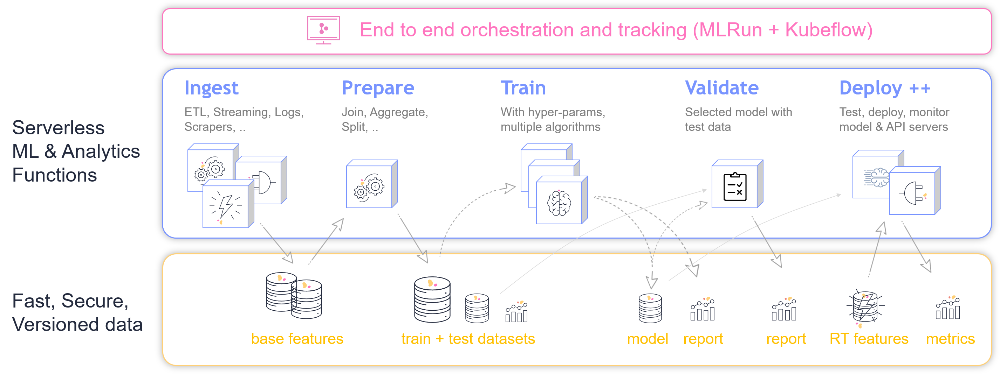
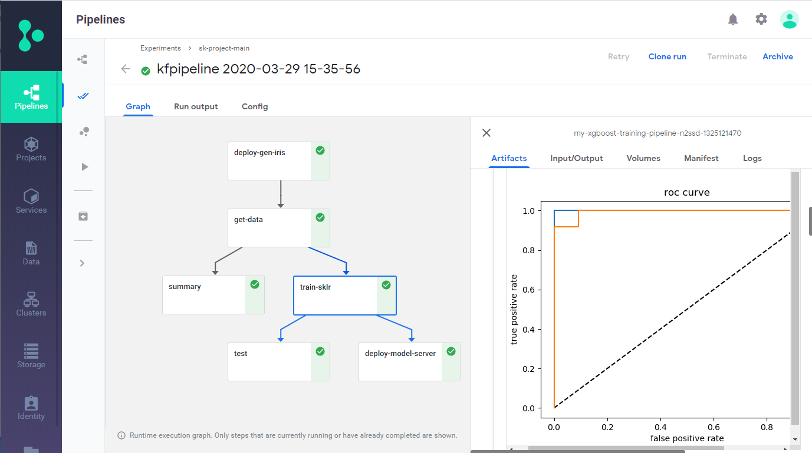
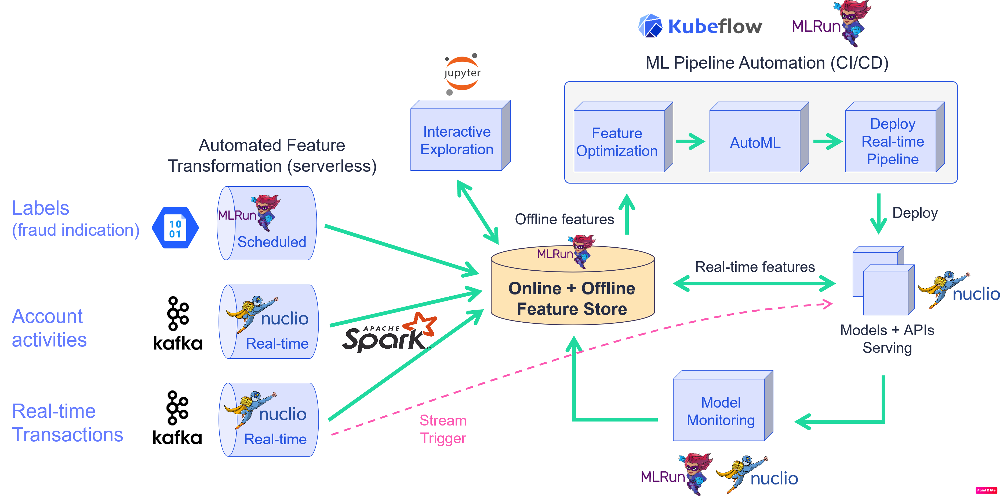
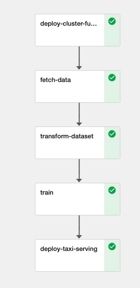

# MLRun Demos

The mlrun/demos repository demonstrates different aspects of working with MLRun by demonstrating complete end-to-end machine-learning (ML) use-case applications.

#### In This Document

- [Overview](#overview)
  - [General ML Workflow](#general-ml-workflow)
- [Prerequisites](#prerequisites)
- [How-To: Converting Existing ML Code to an MLRun Project](#howto-convert-to-mlrun)
- [Mask Detection Demo](#mask-detection-demo)
- [News Article Summarization and Keyword Extraction via NLP](#news-article-summary-nlp)
- [Fraud Prevention - Iguazio Feature Store](#fraud-detection-demo)

## Overview

The MLRun demos are end-to-end use-case applications that leverage [MLRun](https://github.com/mlrun/mlrun) to implement complete machine-learning (ML) pipelines, including data collection and preparation, model training, and deployment automation.

The demos demonstrate how you can:

- Run ML pipelines locally from a web notebook (for example, a Jupyter Notebook).
- Run some, or all tasks on an elastic Kubernetes cluster by using serverless functions.
- Create automated ML workflows using [Kubeflow Pipelines](https://www.kubeflow.org/docs/pipelines/overview/pipelines-overview/).

The demo applications are tested on the [Iguazio Data Science Platform](https://www.iguazio.com/) ("the platform") and use its shared data fabric, which is accessible via the `v3io` file-system mount. 
You can also modify the code to work with any shared file storage by replacing the `apply(v3io_mount())` calls with any other Kubeflow volume modifier.
If you're not already a platform user, [request a free trial](https://www.iguazio.com/lp/14-day-free-trial-in-the-cloud/).

### General ML Workflow

The provided demos implement some or all of the ML workflow steps illustrated in the following image:

## Prerequisites

To run the MLRun demos,you must first do the following:

- Prepare a Kubernetes cluster with preinstalled operators or custom resources (CRDs) for Horovod and/or Nuclio, depending on the demos that you wish to run.
- Install an MLRun service on your cluster. See [MLRun documentation](https://github.com/mlrun/mlrun/blob/master/README.md#installation) for instructions.
- Ensure that your cluster has a shared file or object storage for storing the data (artifacts).

## Mask Detection Demo

The [Mask detection](./mask-detection/README.md) demo contains 3 notebooks where we:
1. **Train and evaluate** a model for detecting if a person is wearing a mask in an image by using Tensorflow.Keras or PyTorch.
2. **Serve** the model as a serverless function in a http endpoint.
3. Write an **automatic pipeline** where we download a dataset of images, train and evaluate the model, then optimize the model (using ONNX) and serve it.

In this demo you will learn how to:
* Create, save and load a MLRun project.
* Write your own MLRun functions and then run them.
* Import MLRun functions from the MLRun Functions Marketplace.
* Use mlrun.frameworks features for tf.keras and pytorch:
  * Auto-logging for both MLRun and Tensorboard.
  * Distributed training using Horovod.
* Serve a model in a serving graph with pre-processing and post-processing functions.
* Test and deploy the serving graph.
* Write and run an automatic pipeline workflow.

## Fraud Prevention - Iguazio Feature Store

This demo showcases the use of MLRun and the feature store through:

- [**Data ingestion & preparation**](01-ingest-datasources.ipynb)
- [**Model training & testing**](02-create-training-model.ipynb)
- [**Model serving**](03-deploy-serving-model.ipynb)
- [**Building An Automated ML Pipeline**](04-pipeline.ipynb)

Fraud prevention specifically is a challenge as it requires processing raw transaction and events in real-time and being able to
quickly respond and block transactions before they occur. Consider, for example, a case where you would like to evaluate the
average transaction amount. When training the model, it is common to take a DataFrame and just calculate the average. However,
when dealing with real-time/online scenarios, this average has to be calculated incrementally.

In this demo we will learn how to **Ingest** different data sources to our **Feature Store**. Specifically, we will consider 2 types of data:

- **Transactions**: Monetary activity between 2 parties to transfer funds.
- **Events**: Activity that done by the party, such as login or password change.

We will walk through creation of ingestion pipeline for each data source with all the needed preprocessing and validation. We will run the pipeline locally within the notebook and then launch a real-time function to **ingest live data** or schedule a cron to run the task when needed.

Following the ingestion, we will create a feature vector, select the most relevant features and create a final model. We will then deploy the model and showcase the feature vector and model serving.

## News Article Summarization and Keyword Extraction via NLP

In this demo, we will create an NLP pipeline that will summarize and extract keywords from a news article URL. We will be using state-of-the-art transformer models such as BERT to perform these NLP tasks.

Additionally, we will be using MLRun's real-time inference graphs to create the pipeline. This allows for easy containerization and deployment of our pipeline on top of a production-ready Kubernetes cluster.

The full pipeline will do the following:
1. Retrieve news article text and metadata from URL using newspaper3k
2. Summarize article text via Huggingface pipeline using DistilBart model
3. Extract article keywords via KeyBERT using BERT-embeddings and cosine similarity
4. Remove the original article text from the response (optional)
5. Persist record in KV table

After using the pipeline, we will be able to visualize the article summary, keywords, and metadata in a Grafana dashboard.

## How-To: Converting Existing ML Code to an MLRun Project

The [**converting-to-mlrun**](howto/converting-to-mlrun/README.md) how-to demo demonstrates how to convert existing ML code to an MLRun project.
The demo implements an MLRun project for taxi ride-fare prediction based on a [Kaggle notebook](https://www.kaggle.com/jsylas/python-version-of-top-ten-rank-r-22-m-2-88) with an ML Python script that uses data from the [New York City Taxi Fare Prediction competition](https://www.kaggle.com/c/new-york-city-taxi-fare-prediction).

The code includes the following components:

1. Data ingestion
2. Data cleaning and preparation
3. Model training
4. Model serving

**Pipeline Output**

