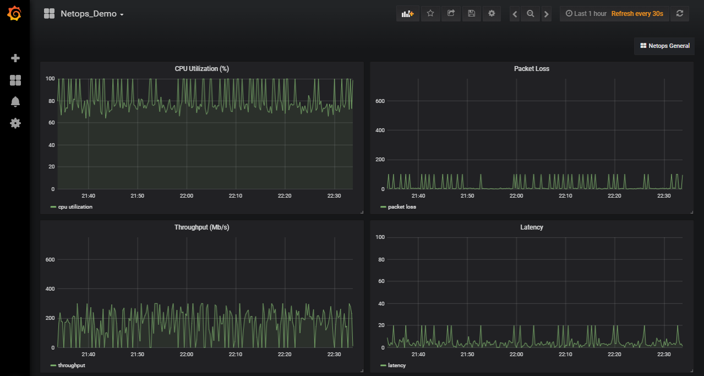

# End to End MLRun Demos

The following examples demonstrate complete machine learning pipelines which include data collection, data preparation, 
model training, validation and automated deployment. 

The examples demonstrate how you can:
 * Run ML functions and pipelines locally on a notebook.
 * Run some or all tasks on an elastic Kubernetes cluster using serverless functions.
 * Create automated ML workflows using [KubeFlow Pipelines](https://www.kubeflow.org/docs/pipelines/overview/pipelines-overview/).

The demo applications are tested on the [Iguazio's Data Science PaaS](https://www.iguazio.com/), 
and use Iguazio's shared data fabric (v3io), and can be modified to work with any shared file storage by replacing the 
```apply(v3io_mount())``` calls with other KubeFlow volume modifiers. You can request a [free trial of Iguazio PaaS](https://www.iguazio.com/lp/14-day-free-trial-in-the-cloud/).

Pre-requisites:
* A Kubernetes cluster with pre-installed operators/CRDs for Horovod, Nuclio, Spark (depending on the specific demo).
* MLRun Service installed in the cluster, [see instructions](https://github.com/mlrun/mlrun/blob/master/README.md#installation).
* Shared file or object storage for the data/artifacts.

### The General ML Pipeline Flow 
The various demos follow some or all of the steps shown in the diagram below:

<br><p align="center"></p><br>


## [Data exploration and end to end Sklearn pipeline with AutoML (Iris dataset)](./sklearn-pipe/sklearn-project.ipynb)

Demonstrate a popular machine learning use case (iris dataset), how to explore the data and build an end to end automated ML pipeline.

The combined CI/Data/ML pipeline includes the following steps:
* Build the iris generator (ingest) function container 
* Ingest the iris data
* Analyze the dataset features
* Train and test the model using multiple algorithms (AutoML)
* Deploy the model as a real-time serverless function
* Test the serverless function REST API with test dataset


to start, download the notebook [sklearn-project.ipynb](./sklearn-pipe/sklearn-project.ipynb) into an empty directory and run the cells one by one.

<br><p align="center"></p><br>


#### Pipeline output:

You can see various output plots in [sklearn-pipe/plots](sklearn-pipe/plots)


<br><p align="center"></p><br>


## [Image Classification Using Distributed Training (Horovod)](horovod-pipe/horovod-project.ipynb)

This example is using TensorFlow, Horovod, and Nuclio demonstrating end to end solution for image classification, 
it consists of 4 MLRun and Nuclio functions and Kubeflow Pipelines Orchastration:

1. **Download**: import an image archive from S3 to the cluster file system
2. **Label**: Tag the images based on their name structure 
3. **Traing**: Distrubuted training using TF, Keras and Horovod
4. **Inference**: Automated deployment of Nuclio model serving function 

<br><p align="center"></p><br>

#### Pipeline output:

<br><p align="center"></p><br>

## [Real-time face recognition with re-enforced learning](faces/README.md)

Demonstrate real-time face image capture, recognition, and location tracking of identities.

This comprehensive demonstration includes multiple components: a live image capture utility, image identification and tracking, a labeling app to tag unidentified faces using Streamlit, and model training.

#### Pipeline output:

<br><p align="center"></p><br>


## [Predictive Network/Telemetry Monitoring](https://github.com/mlrun/demo-network-operations)

Demonstrate ingestion of telemetry data from simulator or live stream, feature exploration, 
data preparation (aggregation), model training, and automated model deployment.

The demo is maintained in a separate Git repository and also demonstrates how to manage project lifecycle using git.

<br><p align="center"></p><br>

#### Pipeline output:

<br><p align="center"></p><br>


## [LighGBM Classification with Hyper Parameters (HIGGS dataset)]()

**TBD under construction**

Demonstrate a popular big data, machine learning competition use case (the HIGGS UCI dataset) and how to run training in parallel with hyper-parameters.

The first step is retrieveing and storing the data in parquet fromat, partitioning it into train, validation and test sets, followed by parallel LightGBM training, and automated model deployment.


