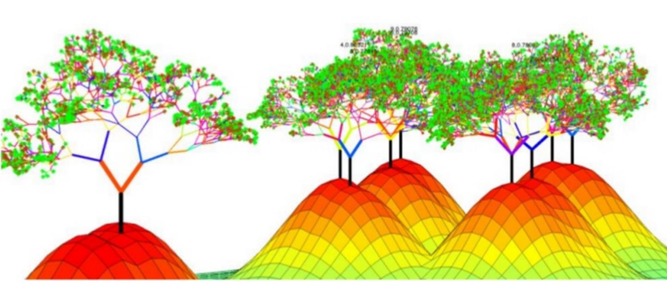

# End to End MLRun Demos

The following examples demonstrate complete machine learning pipelines which include data collection, data preparation, 
model training and automated deployment. 

The examples demonstrate how you can:
 * Run pipelines on locally on a notebook.
 * Run some or all tasks on an elastic Kubernetes cluster using serverless functions.
 * Create automated ML workflows using [KubeFlow Pipelines](https://www.kubeflow.org/docs/pipelines/overview/pipelines-overview/).

The demo applications are tested on the [Iguazio's Data Science PaaS](https://www.iguazio.com/), 
and use Iguazio's shared data fabric (v3io), and can be modified to work with any shared file storage by replacing the 
```apply(v3io_mount())``` calls with other KubeFlow volume modifiers. You can request a [free trial of Iguazio PaaS](https://www.iguazio.com/lp/14-day-free-trial-in-the-cloud/).

Pre-requisites:
* A Kubernetes cluster with pre-installed operators/CRDs for Horovod, Nuclio, Spark (depending on the specific demo).
* MLRun Service installed (httpd), [see instructions](https://github.com/mlrun/mlrun/blob/master/README.md#installation) (alternatively can use a shared file system to store metadata).

## [XGBoost Classification with Hyper Parameters (Iris dataset)](https://github.com/mlrun/demo-xgb-project)

Demonstrate a popular machine learning use case (iris dataset) and how to run training in parallel with hyper-parameters.

The first step is injecting the iris dataset, followed by parallel XGBoost training, and automated model deployment

<br><p align="center"></p><br>

## [LighGBM Classification with Hyper Parameters (HIGGS dataset)]()

*TBD*

Demonstrate a popular big data, machine learning competition use case (the HIGGS UCI dataset) and how to run training in parallel with hyper-parameters.

The first step is retrieveing and storing the data in parquet fromat, partitioning it into train, validation and test sets, followed by parallel LightGBM training, and automated model deployment.


## [Image Classification Using Distributed Training (Horovod)](https://github.com/mlrun/demo-image-classification)

Demonstrate a use case of image classification using TensorFlow, Keras and Horovod.

The demo includes 4 steps: download the images repository, label the images, run a distributed job over MPI (Horovod), and finally, deploy the model serving Nuclio function.

<br><p align="center"></p><br>

## [Real-time face recognition with re-enforced learning](faces/README.md)

Demonstrate real-time face image capture, recognition, and location tracking of identities.

This comprehensive demonstration includes multiple components: a live image capture utility, image identification and tracking, a labeling app to tag unidentified faces using Streamlit, and model training.

<br><p align="center"></p><br>


## [Predictive Network/Telemetry Monitoring](netops/README.md)

Demonstrate ingestion of telemetry data from simulator or live stream, feature exploration, 
data preparation, model training, and automated model deployment.

<br><p align="center"></p><br>

