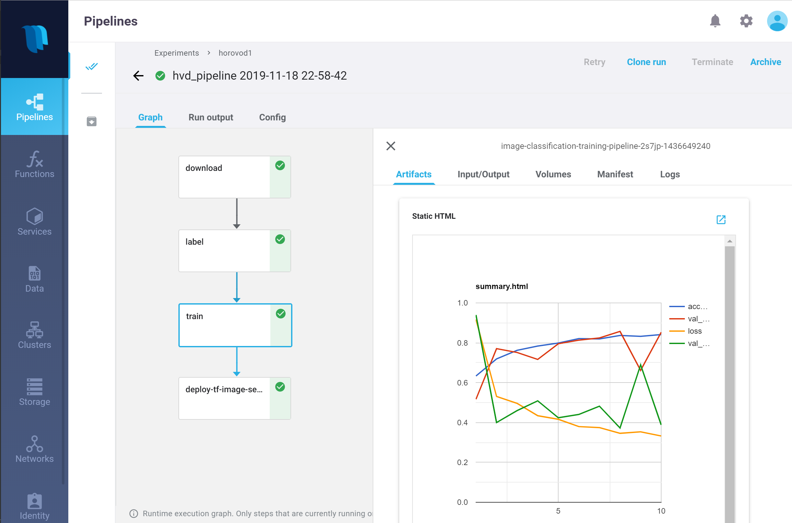

# MLRun Demos &mdash; End-to-End Use-Case Applications

The MLRun demos are end-to-end use-case applications that demonstrate complete machine-learning ("ML") pipelines &mdash; including data collection and preparation, model training, and deployment automation.

#### In This Document

- [Overview](#overview)
- [Prerequisites](#prerequisites)
- [XGBoost classification with hyperparameters (Iris data set)](#xgboost-demo)
- [LightGBM classification with hyperparameters (HIGGS data set)](#lightgbm-demo)
- [Image classification using distributed training (Horovod)](#image-classification-demo)
- [Real-time face recognition with deep learning](#faces-demo)
- [Predictive telemetry/network operations (NetOps) monitoring](#netops-demo) [WORK IN PROGRESS]
- [Serverless Spark](#serverless-spark-demo)

## Overview

The demos demonstrate how you can

- Run pipelines locally from a web notebook such as Jupyter Notebook.
- Run some or all tasks on an elastic Kubernetes cluster by using serverless functions.
- Create automated ML workflows using [Kubeflow Pipelines](https://www.kubeflow.org/docs/pipelines/overview/pipelines-overview/).

The demo applications are tested on the [Iguazio Data Science Platform](https://www.iguazio.com/) ("the platform") and use its shared data fabric, which is accessible via the `v3io` file-system mount; if you're not already a platform user, [request a free trial](https://go.iguazio.com/start-your-free-triail).
You can also modify the code to work with any shared file storage by replacing the `apply(v3io_mount())` calls with any other Kubeflow volume modifier.

## Prerequisites

To run the MLRun demos, first do the following:

- Prepare a Kubernetes cluster with preinstalled operators or custom resources (CRDs) for Horovod, Nuclio, and/or Spark &mdash; depending on the demos that you wish to run.
- Install the MLRun RESTful database (DB), which uses the Apache HTTP Server ("httpd"); see [**mlrundb.yaml**](https://github.com/mlrun/mlrun/blob/master/hack/mlrundb.yaml).
  Alternatively, you can use a shared file system to store metadata.

## XGBoost classification with hyperparameters (Iris data set)

The XGBoost classification demo ([**xgboost**](xgboost/README.md)) demonstrates how to implement a popular machine-learning use case &mdash; binary classification on the Iris data set &mdash; and run model training in parallel with hyperparameters.

The demo injects the Iris data set, runs parallel [XGBoost](https://xgboost.readthedocs.io) model training with hyperparameters, and automates the model deployment.

 

 

## LightGBM classification with hyperparameters (HIGGS data set)

The LightGBM classification demo ([**lightgbm**](lightgbm/README.md)) demonstrates how to implement a popular machine-learning competition use case &mdash; binary classification on the HIGGS data set &mdash; and run model training in parallel with hyperparameters.

The demo retrieves and stores the data in Parquet format, partitioning it into training, validation and test sets; runs parallel [LightGBM](https://github.com/microsoft/LightGBM) model training; and automates the model deployment.

 

 

## Image classification using distributed training (Horovod)

The image-classification demo ([**image-classification**](image-classification/README.md)) demonstrates a use case of image recognition and classification using [TensorFlow](https://www.tensorflow.org/), [Keras](https://keras.io/), and [Horovod](https://eng.uber.com/horovod/).

The demo downloads the images repository; identities (recognizes) and classifies (labels) the images by using TensorFlow and Keras; runs a distributed Horovod job over MPI; and finally, deploys a Nuclio function for serving the model.

 

 

## Real-time face recognition with deep learning

The face-recognition demo ([**faces**](faces/README.md)) demonstrates real-time capture, recognition, and classification of face images over a video stream, as well as location tracking of identities.

This comprehensive demo includes multiple components: a live image capture utility; image identification (recognition) and tracking using [OpenCV](https://opencv.org/); a labeling application for tagging unidentified faces using [Streamlit](https://www.streamlit.io/); model training using [PyTorch](https://pytorch.org); and automated model deployment using [Nuclio](https://nuclio.io/).

 

 

## Predictive telemetry/network operations (NetOps) monitoring

The predictive network-operations (NetOps) demo ([**netops**](netops/README.md)) demonstrates ingestion of telemetry/Network Operations (NetOps) data from a simulator or live stream, feature exploration, data preparation, model training, and automated model deployment.

> **Note:** This demos is currently work in progress.

 

 

## Serverless Spark

The serverless Spark demo ([**mlrun-sparkk8s**](spark/mlrun-sparkk8s.ipynb)) demonstrates how to run the same spark job locally and as a distributed MLRun job over Kubernetes.
The Spark function can be incorporated as a step in various data-preparation and machine-learning scenarios.
<!-- [c-serverless-spark-demo] TODO: Link to the spark/README.md file when
  updated. -->

