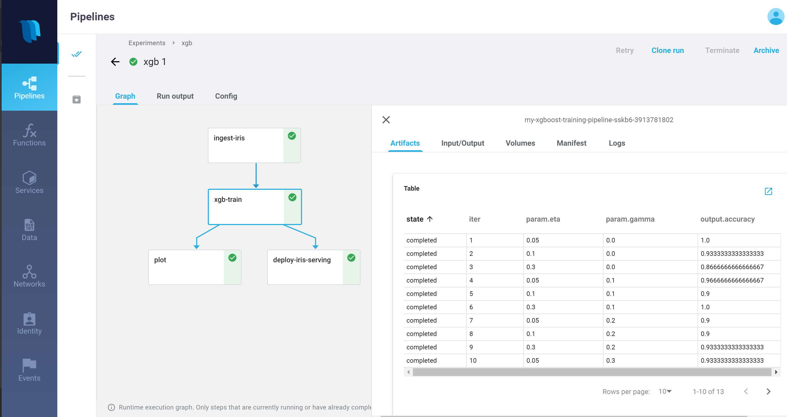
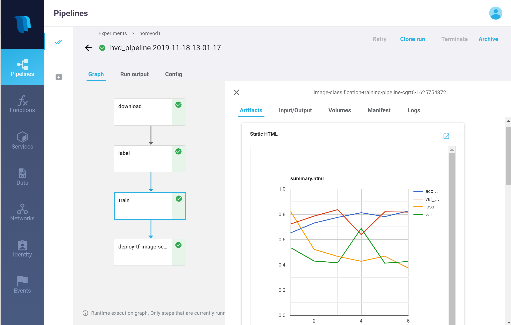

# End to End MLRun Demos

The following examples demonstrate complete machine learning pipelines which include data collection, data preparation, 
model training and automated deployment. 

The examples demonstrate how you can:
 * run pipelines on locally on a notebook
 * run some or all tasks on an elastic Kubernetes cluster using serverless functions
 * create automated ML workflows using [KubeFlow Pipelines](https://www.kubeflow.org/docs/pipelines/overview/pipelines-overview/) 

the demo applications are tested on [Iguazio's data science PaaS](https://www.iguazio.com/), 
and use iguazio shared data fabric (v3io), the can be modified to work with any shared file storage by replacing the 
`apply(v3io_mount())` calls with other KubeFlow volume modifiers. You can request a [free trial of Iguazio PaaS](https://www.iguazio.com/lp/14-day-free-trial-in-the-cloud/).

Pre-requisites:
* need to have a Kubernetes cluster with pre-installed operators/CRDs for Horovod, Nuclio, Spark (depending on the specific demo)
* Have MLRun RESTfull DB installed (httpd), [see YAML](https://github.com/mlrun/mlrun/blob/master/hack/mlrundb.yaml) (alternatively can use a shared file system to store metadata)

## [XGBoost Classification with Hyper Parameters (Iris dataset)](xgboost/train_xgboost_serverless.ipynb)

Demonstrate a popular machine learning use case (iris dataset) and how to run training in parallel with hyper-parameters.

The first step is injecting the iris dataset, followed by parallel XGBoost training, and automated model deployment

 

 

## [Image Classification Using Distributed Training (Horovod)](image_classification/README.md)

Demonstrate a use case of image classification using TensorFlow, Keras and Horovod.

The demo include 4 steps: download images repository, label the images, 
run a distributed job over MPI (Horovod), deploy a model serving Nuclio function.

 

 

## [Real-time face recognition with re-enforced learning](faces/readme.md)

Demonstrate real-time face images capture and recognition, and location tracking of identities.

This comprehensive e demo include multiple components: live images capture utility, images identification and tracking, 
labeling app (using Streamlit) to tag unidentified faces, and model training

> work in progress 

## [Predictive Network/Telemetry Monitoring]()

Demonstrate ingestion of telemetry data from simulator or live stream, feature exploration, 
data preparation, model training, and automated model deployment.

> work in progress 

## [Running Serverless Spark](spark/mlrun_sparkk8s.ipynb)

Demonstrate how the same spark job can run locally and as a distributed MLRun job over Kubernetes.
The Spark function can be incorporated as a step in various data preparation and machine learning scenarios.
 