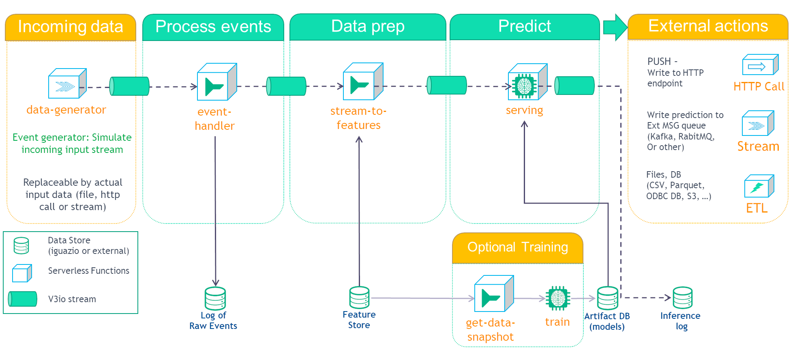

# MLRun Demos

The mlrun/demos repository provides demos that implement full end-to-end ML use-case applications with MLRun and demonstrate different aspects of working with MLRun.

#### In This Document

- [Overview](#overview)
  - [General ML Workflow](#general-ml-workflow)
- [Prerequisites](#prerequisites)
- [Mask Detection Demo](#mask-detection-demo)
- [scikit-learn Demo: Full AutoML Pipeline](#demo-scikit-learn)
- [Image Classification with Distributed Training Demo](#demo-image-classification)
- [Churn Demo: Real-Time Customer-Churn Prediction](#demo-churn)
- [NetOps Demo: Predictive Network Operations/Telemetry](#demo-netops)
- [Model deployment Pipeline: Real-time operational Pipeline](#demo-model-deployment)
- [How-To: Converting Existing ML Code to an MLRun Project](#howto-convert-to-mlrun)

## Overview

The MLRun demos are end-to-end use-case applications that leverage [MLRun](https://github.com/mlrun/mlrun) to implement complete machine-learning (ML) pipelines &mdash; including data collection and preparation, model training, and deployment automation.

The demos demonstrate how you can

- Run ML pipelines locally from a web notebook such as Jupyter Notebook.
- Run some or all tasks on an elastic Kubernetes cluster by using serverless functions.
- Create automated ML workflows using [Kubeflow Pipelines](https://www.kubeflow.org/docs/pipelines/overview/pipelines-overview/).

The demo applications are tested on the [Iguazio Data Science Platform](https://www.iguazio.com/) ("the platform") and use its shared data fabric, which is accessible via the `v3io` file-system mount; if you're not already a platform user, [request a free trial](https://www.iguazio.com/lp/14-day-free-trial-in-the-cloud/).
You can also modify the code to work with any shared file storage by replacing the `apply(v3io_mount())` calls with any other Kubeflow volume modifier.

### General ML Workflow

The provided demos implement some or all of the ML workflow steps illustrated in the following image:

## Prerequisites

To run the MLRun demos, first do the following:

- Prepare a Kubernetes cluster with preinstalled operators or custom resources (CRDs) for Horovod and/or Nuclio, depending on the demos that you wish to run.
- Install an MLRun service on your cluster.
  See the instructions in the [MLRun documentation](https://github.com/mlrun/mlrun/blob/master/README.md#installation).
- Ensure that your cluster has a shared file or object storage for storing the data (artifacts).

## Mask Detection Demo

The [Mask detection](./mask-detection/README.md) demo is a 3 notebooks demo where we:
1. **Train and evaluate** a model for detecting whether a person is wearing a mask in an image using Tensorflow.Keras or PyTorch.
2. **Serve** the model as a serverless function in a http endpoint.
3. Write an **automatic pipeline** where we download a dataset of images, train and evaluate, optimize the model (using ONNX) and serve it.

In this demo you will learn how to:
* Create, save and load a MLRun project.
* Write your own MLRun functions and run them.
* Import MLRun function from the MLRun Functions Marketplace.
* Use mlrun.frameworks features for tf.keras and pytorch:
  * Auto-logging for both MLRun and Tensorboard.
  * Distributed training using Horovod.
* Serve a model in a serving graph with pre and post processing functions.
* Test and deploy the serving graph.
* Write and run an automatic pipeline workflow.

## scikit-learn Demo: Full AutoML Pipeline

The [**scikit-learn-pipeline**](./scikit-learn-pipeline/README.md) demo demonstrates how to build a full end-to-end automated-ML (AutoML) pipeline using [scikit-learn](https://scikit-learn.org) and the UCI [Iris data set](http://archive.ics.uci.edu/ml/datasets/iris).

The combined CI/data/ML pipeline includes the following steps:

- Create an Iris data-set generator (ingestion) function.
- Ingest the Iris data set.
- Analyze the data-set features.
- Train and test the model using multiple algorithms (AutoML).
- Deploy the model as a real-time serverless function.
- Test the serverless function's REST API with a test data set.

To run the demo, download the [**sklearn-project.ipynb**](./scikit-learn-pipeline/sklearn-project.ipynb) notebook into an empty directory and run the code cells according to the instructions in the notebook.

**Pipeline Output**

The output plots can be viewed as static HTML files in the [scikit-learn-pipeline/plots](scikit-learn-pipeline/plots) directory.

## Image Classification with Distributed Training Demo

The [**image-classification-with-distributed-training**](image-classification-with-distributed-training/README.md) demo demonstrates an end-to-end image-classification solution using [TensorFlow](https://www.tensorflow.org/) (versions 1 or 2), [Keras](https://keras.io/), [Horovod](https://eng.uber.com/horovod/), and [Nuclio](https://nuclio.io/).

The demo consists of four MLRun and Nuclio functions and a Kubeflow Pipelines orchestration:

1. **Download** &mdash; import an image archive from AWS S3 to your cluster's data store.
2. **Label** &mdash; tag the images based on their name structure.
3. **Training** &mdash; perform distributed training using TensorFlow, Keras, and Horovod.
4. **Inference** &mdash; automate deployment of a Nuclio model-serving function.

> **Note:** The demo supports both TensorFlow versions 1 and 2.
> There's one shared notebook and two code files &mdash; one for each TensorFlow version.

**Demo Workflow**

**Pipeline Output**

## Churn Demo: Real-Time Customer-Churn Prediction

The [**churn**](./customer-churn-prediction/README.md) demo demonstrates analysis of customer-churn data using the Kaggle [Telco Customer Churn data set](https://www.kaggle.com/blastchar/telco-customer-churn), model training and validation using [XGBoost](https://xgboost.readthedocs.io), and model serving using real-time Nuclio serverless functions.

The demo consists of few MLRun and Nuclio functions and a Kubeflow Pipelines orchestration:

1.  Write custom data encoders for processing raw data and categorizing or "binarizing" various features.
2.  Summarize the data, examining parameters such as class balance and variable distributions.
3.  Define parameters and hyperparameters for a generic XGBoost training function.
4.  Train and test several models using XGBoost.
5.  Identify the best model for your needs, and deploy it into production as a real-time Nuclio serverless function.
6.  Test the model server.

**Pipeline Output**

## NetOps Demo: Predictive Network Operations/Telemetry

The [NetOps demo](network-operations/README.md) demo demonstrates how to build an automated ML pipeline for predicting network outages based on network-device telemetry, also known as Network Operations (NetOps).
The demo implements both model training and inference, including model monitoring and concept-drift detection.
The demo simulates telemetry network data for running the pipeline.

The demo demonstrates how to

- Manage MLRun projects.
- Use GitHub as a source for functions to use in pipeline workflows.
- Use MLRun logging to track results and artifacts.
- Use MLRun to run a [Kubeflow Pipelines](https://www.kubeflow.org/docs/pipelines/) pipeline.
- Deploy a live-endpoints production pipeline.
- Deploy a concept-drift pipeline.

The demo implements three pipelines:

- **Training pipeline** &mdash; ingestion of telemetry data, exploratory data analysis, data preparation (aggregation), feature selection, and model training and testing.
- **Production-deployment pipeline** &mdash; automated model deployment.
- **Concept-drift pipeline** &mdash; streaming of concept-drift detectors using a live Nuclio endpoint, and application of multiple drift-magnitude metrics to asses the drift between a base data set and the latest data.

**Pipeline Output**

## Model deployment Pipeline: Real-time operational Pipeline

This demo shows how to deploy a model with streaming information.

This demo is comprised of several steps:

While this demo covers the use case of 1st-day churn, it is easy to replace the data, related features and training model and reuse the same workflow for different business cases.

These steps are covered by the following pipeline:

- **1. Data generator** — Generates events for the training and serving and Create an enrichment table (lookup values). 
- **2. Event handler** - Receive data from the input. This is a common input stream for all the data. This way, one can easily replace the event source data (in this case we have a data generator) without affecting the rest of this flow. It also store all incoming data to parquet files.
- **3. Stream to features** - Enrich the stream using the enrichment table and Update aggregation features using the incoming event handler.
- **4. Optional model training steps -**
 - **4.1 Get Data Snapshot** - Takes a snapshot of the feature table for training.
  - **4.2 Describe the Dataset** - Runs common analysis on the datasets and produces plots suche as histogram, feature importance, corollation and more.
  - **4.3 Training** - Runing training with multiple classification models.
  - **4.4 Testing** - Testing the best performing model.
- **5. Serving** - Serve the model and process the data from the enriched stream and aggregation features.
- **6. Inference logger** - We use the same event handler function from above but only its capability to store incoming data to parquet files.

## How-To: Converting Existing ML Code to an MLRun Project

The [**converting-to-mlrun**](howto/converting-to-mlrun/README.md) how-to demo demonstrates how to convert existing ML code to an MLRun project.
The demo implements an MLRun project for taxi ride-fare prediction based on a [Kaggle notebook](https://www.kaggle.com/jsylas/python-version-of-top-ten-rank-r-22-m-2-88) with an ML Python script that uses data from the [New York City Taxi Fare Prediction competition](https://www.kaggle.com/c/new-york-city-taxi-fare-prediction).

The code includes the following components:

1. Data ingestion
2. Data cleaning and preparation
3. Model training
4. Model serving

**Pipeline Output**

