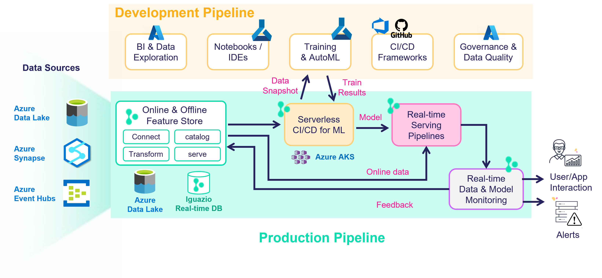

# Building Production Pipelines WIth AzureML and MLRun

**In This demo we show how to:**

0. **Setup the environment**
1. **Use MLRun Feature Store to ingest and prepare data**
2. **Create offline feature vector (snapshot) for training**
3. **Run AzureML AutoML Service as an automated step (function) in MLRun:**
  * take a snapshot of the offline feature vector and register as an AzureDL dataset
  * Initialize the required resources, experiments and AutoML job in AzureML and track its progress
  * Retrieve the generated models along with their results and register in MLRun
4. **View and compare the AzureML Models using MLRun tools**
5. **Build Real-time Serving pipeline with multiple stages:**
  * Accepts and parse requests
  * Enrich and impute with real-time features (from the feature store)
  * Predict using an ensemble of 3 models (Generated by AzureML)
  * Respond with average prediction
6. **Provide real-time model monitoring**

### Notebook

the demo has a single notebook:

- [**azureml_demo.ipynb**](azureml_demo.ipynb) &mdash; implement all the steps outlined above.

