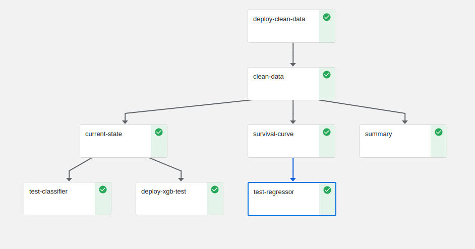

# churn demo
_____________

It's easy to make a business case for running customer churn analyses--given some relevant data, if we could only spot those scenarios where some measurable intervention might have a high likelihood of generating value.   And if turns out that the expected return, however measured, is greater than the cost of intervening, also however measured, we could start looking for ways to integrate the model into a real-world test scenario and begin a second phase of testing and likely modelling.  

But by the time we get to this second stage quite a few non-data-scientists have become involved in our so-called "churn project".  In addition to iso-charts and precision-recall tables, now there are seemingly endless streams and events, latencies, pods and logs, api-endpoints, versioning and canary deployments.  And if this is churn in a regulated industry, say finance or health, add compliance layers, significantly more testing and validation...more streams, more appliances, and of course, more data and more code.

And you have to be wondering, will all of this added infrastructure destroy the anticipated value generated by that original model you developed? From your own perspective, what started off as a hypothesis, a notebook and your favorite python packages has now become a treasure hunt in a jungle of endpoints, artifacts and riddles. What if someone where to ask:
* how much did it really cost us to build this model anyway?   
* Are we gonna get sued next quarter? 
* If we get more data, how much better can our model get? 
* How much would that extra bit of performance, however measured, cost? 
* What's the recommended expiry date for the model?

Clearly some guiding framework is needed that can seamlessly integrate data-science workflows into the infrastructure described above **and** enbale data-scientists to continue developing and monitoring and providing answers throughout the model's lifecycle.

In the accompanying notebook we work through a well-known **[churn data set](https://www.kaggle.com/blastchar/telco-customer-churn/download)**, and demonstrate  how we can use **[mlrun projects](https://github.com/mlrun)**,  **[Nuclio functions](https://nuclio.io/)** functions, and **[Kubeflow pipelines](https://www.kubeflow.org/)** to set up and deploy a realistic churn model in a production environment.  Along the way we will:
1. write custom data encoders:  raw data often needs to be processed, some features need to be categorized, other binarized.
2. summarize data: look at things like class balance, variable distributions.
3. define parameters and hyperparameters for a generic XGBoost training function
4. train and test a number of models
5. deploy a "best" models into "production" as a nuclio serverless functions
6. test the model servers

Additionally, we will demonstrate
* how logs and artifacts are collected throughtout the entire process, 
* how results can be compared
* how github can help streamline, and most importantly document and version your entire process

### worklflow summary
1. clean data, most often this will have some custom component
2. train and tune one or more models
3. deploy a combination of servers:
    * **xgb classifier** - to answer the question, what is the our client's current state? **churned** or **not churned**?
    * **cox regressor**  - what is the **expected survival** of this client (or machine, patient)? 
 
 

## further development
### event simulator
Since we only have this one dataset, a "live" demonstration will require either changing datasets, or generating simulated data based on the existing telco sample.  Generative models are becoming more and more popular in research, training and in outright applications, so we will be adding a variational encoder (vae) to our list of functions (~10 lines).  Given a clean and encoded original dataset, the vae can be connected to a stream...There are other approaches, under/oversampling etc...

### recommendations
who needs attention?  how should we schedule interventions? (more xgboost)

### apply this to your data
how can you adapt this project to suit your own needs?

## data science tags
xgboost 
cox proprortional hazards regression 
classifiers 
survival analysis 

