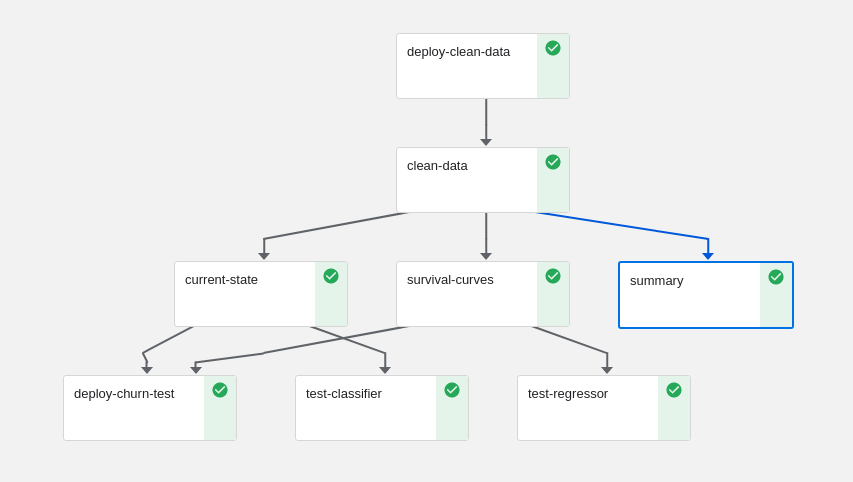

# churn demo
_____________

It's easy to make a business case for running customer churn analyses--given some relevant data, if we could only spot those scenarios where some measurable intervention might have a high likelihood of generating value. From the data-scientist's perspective, making that case starts with some questions, data, and some ideas about how to model that data.  

The **[Kaggle Telco Churn dataset](https://www.kaggle.com/blastchar/telco-customer-churn)** is a great starting point, enabling us to set up an almost completely generic pipeline with all the core components of a what could eventually become a complex churn prediction and intervention system.  As a bonus, the same setup could be used to develop a **[predictive maintenance system](https://docs.microsoft.com/en-us/archive/msdn-magazine/2019/may/machine-learning-using-survival-analysis-for-predictive-maintenance)**, or provide a key component in a health care and prevention system.

Churn can initally be approached as a binary classification problem.  We start with one or more static feature tables and estimate a prediction function.  In a real-time setting we could also join live aggregates to these static tables and then train a very high resolution churn-detection classifier. The churn detector developed in this notebook has one component that performs this type of static churn classification. It's called **current-state** in the pipeline flow chart below.

However, we can look to **[survival analysis](https://en.wikipedia.org/wiki/Survival_analysis)** if our data is time stamped in such a way that we can define a duration feature that represents the age of an observation (for data stored in a database, see **[example sql query to get survival data from a table](https://lifelines.readthedocs.io/en/latest/Examples.html#example-sql-query-to-get-survival-data-from-a-table)**). Fortunately, the Telco dataset contains the client's  contract tenure in months.  So a second regressor branch trains a number of survivability models that will enable us to provide estimates of the timing of events leading to churn, and these can be found in **survival-curves** in the pipeline flow chart below.  (Currently, they only provide information as this notebook is currently in development).

## mlrun and nuclio

in developing this churn model we highlight how we can use **[mlrun projects](https://github.com/mlrun)**,  **[nuclio functions](https://nuclio.io/)** functions, and **[kubeflow pipelines](https://www.kubeflow.org/)** to set up and deploy a realistic churn model in a production environment.  Along the way we will:
1. write custom data encoders:  raw data often needs to be processed, some features need to be categorized, other binarized.
2. summarize data: look at things like class balance, variable distributions.
3. define parameters and hyperparameters for a generic XGBoost training function
4. train and test a number of models
5. deploy a "best" models into "production" as a nuclio serverless functions
6. test the model servers

Additionally, we will demonstrate
* how logs and artifacts are collected throughtout the entire process, 
* how results can be compared
* how github can help streamline, and most importantly document and version your entire process

## further development
### event simulator
Since we only have this one dataset, a "live" demonstration will require either changing datasets, or generating simulated data based on the existing telco sample.  Generative models are becoming more and more popular in research, training and in outright applications, so we will be adding a variational encoder (vae) to our list of functions (~10 lines).  Given a clean and encoded original dataset, the vae can be connected to a stream...There are other approaches, under/oversampling etc...

### recommendations
who needs attention?  how should we schedule interventions?

### apply this to your data
how can you adapt this project to suit your own needs?

## data science tags
xgboost 
cox proprortional hazards regression 
classifiers 
survival analysis 

