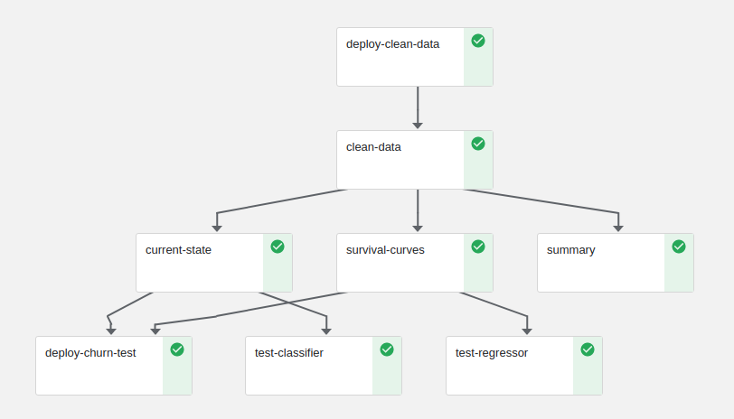

# Churn Demo: Real-Time Customer-Churn Prediction

This demo demonstrates analyses of customer-churn data using the Kaggle [Telco Customer Churn data set](https://www.kaggle.com/blastchar/telco-customer-churn), model training and validation using [XGBoost](https://xgboost.readthedocs.io), and model serving using real-time Nuclio serverless functions.

#### In This Document

- [Overview](#overview)
- [MLRun and Nuclio](#mlrun-and-nuclio)
- [Further Development](#further-development)
- [Data Science Tags](#data-science-tags)

## Overview

It's easy to make a business case for running customer-churn analyses (given some relevant data) if you could only spot those scenarios where some measurable intervention might have a high likelihood of generating value.
From the data scientist's perspective, making that case starts with some questions, data, and a few ideas about how to model that data.

The Kaggle Telco Customer Churn data set is a great starting point, enabling you to set up an almost completely generic pipeline with all the core components of a what could eventually become a complex churn prediction and intervention system.
As a bonus, the same setup could be used to develop a **[predictive maintenance system](https://docs.microsoft.com/en-us/archive/msdn-magazine/2019/may/machine-learning-using-survival-analysis-for-predictive-maintenance)**, or provide a key component in a health care and prevention system.

Churn can initially be approached as a binary classification problem.
You start with one or more static feature tables and estimate a prediction function.
In a real-time setting, you could also join live aggregates to these static tables and then train a very high resolution churn-detection classifier.
The churn detector developed in this notebook has one component that performs this type of static churn classification (**"current-state"** in the [demo pipeline's flow chart](#pipeline-output)).

However, you can look to **[survival analysis](https://en.wikipedia.org/wiki/Survival_analysis)** if your data is time stamped in such a way that you can define a duration feature that represents the age of an observation.
(For data stored in a database, see the [example SQL query to get survival data from a table](https://lifelines.readthedocs.io/en/latest/Examples.html#example-sql-query-to-get-survival-data-from-a-table)).
Fortunately, the Telco Customer Churn data set contains the client's contract tenure in months.
So, a second regressor branch trains a number of survivability models that enable you to provide estimates of the timing of events leading to churn (**"survival-curves"** in the [demo pipeline's  flow chart](#pipeline-output)).
(Currently, this is the only provided information, as this notebook is still in development.)

## MLRun and Nuclio

This churn model highlights how you can use **[MLRun projects](https://github.com/mlrun)**, **[Nuclio functions](https://nuclio.io/)** functions, and **[Kubeflow Pipelines](https://www.kubeflow.org/)** to set up and deploy a realistic churn model in a production environment.
Along the way you'll

1.  Write custom data encoders for processing raw data and categorizing or "binarizing" various features.
2.  Summarize the data, examining parameters such as class balance and variable distributions.
3.  Define parameters and hyperparameters for a generic XGBoost training function.
4.  Train and test several models using XGBoost.
5.  Identify the best model for your needs, and deploy it into production as a real-time Nuclio serverless function.
6.  Test the model server.

Additionally, you're learn how

- Logs and artifacts are collected throughout the entire process.
- Results can be compared.
- GitHub can help streamline &mdash; and most importantly, document and version &mdash; your entire process.

## Pipeline Output

## Further Development

### Event Simulator

As you only have this single data set, a "live" demonstration requires either changing data sets, or generating simulated data based on the existing Telco sample.
Generative models are becoming increasingly popular in research, training, and outright applications, so the demo adds a variational encoder (**"vae"**) to your list of functions (~10 lines).
Given a clean and encoded original data set, the vae can be connected to a stream.
There are also other approaches, such as undersampling or oversampling.

### Recommendations

Who needs attention? How should interventions be scheduled?

### Apply This to Your Data

How can you adapt this project to suit your own needs?

## Data Science Tags

- xgboost
- cox proportional hazards regression
- classifiers 
- survival analysis

