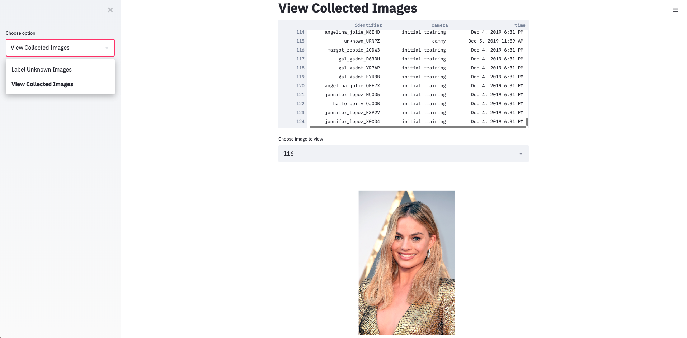

# Deploying a Streamlit Image-Management Dashboard

Perform the following steps to deploy an interactive [Streamlit](Streamlit) dashboard for classifying (labeling) and browsing collected images in your Iguazio Data Science Platform (**"the platform"**) environment:

1. On your local computer, edit the [**faces/streamlit/streamlit.yaml**](streamlit.yaml) demo configuration file to replace the two `<ACCESS_KEY>` placeholder instances with a valid access key for your platform environment:

    ```yaml
    spec:
      ...
      template:
        ...
        spec:
          containers:
          - name: streamlit
            ...
            env:
            - name: "V3IO_ACCESS_KEY"
              value: <ACCESS_KEY>
            ...
          volumes:
          - flexVolume:
            driver: v3io/fuse
            options:
              accessKey: <ACCESS_KEY>
              ...
    ```

2. In your platform environment, create a Jupyter Notebook service and then clone the [mlrun/demos](https://github.com/mlrun/demos/) repository (clone URL https://github.com/mlrun/demos.git).
    Use the clone path **/User/demos/demos**, and ensure that at the end, the **dashboard.py** script exists in the following path &mdash; **/User/demos/demos/faces/streamlit/dashboard.py**.

    > **Note:** The demo currently requires that you log into the platform as user "iguazio".

3. Ensure that you have a trained model, generated by using the [face-recognition.ipynb](notebooks/face-recognition.ipynb) demo notebook.

4. Run the following command from a command-line shell on your local computer to deploy the Streamlit dashboard as a service; ensure that the current directory has your edited **streamlit.yaml** file or change the path (`-f`) to point to your file:
    ```sh
    kubectl -n default-tenant apply -f streamlit.yaml
    ```

    > **Note:** To successfully run this `kubectl` command you need a **kubeconfig** file with the required permissions.
    > Contact [Iguazio support](mailto:support@iguazio.com) for assistance.

5. In your web browser, go to port 30090 of your platform's application node &mdash; `<your platform application-node IP address>:30090` &mdash; and view your interactive Streamlit dashboard:

    <br><p align="center"></p><br>

