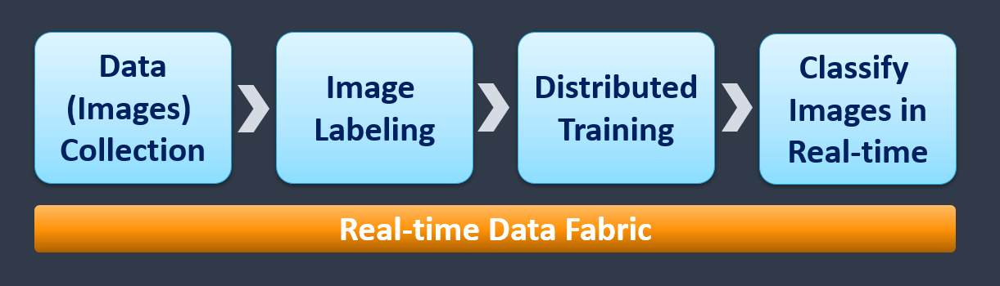
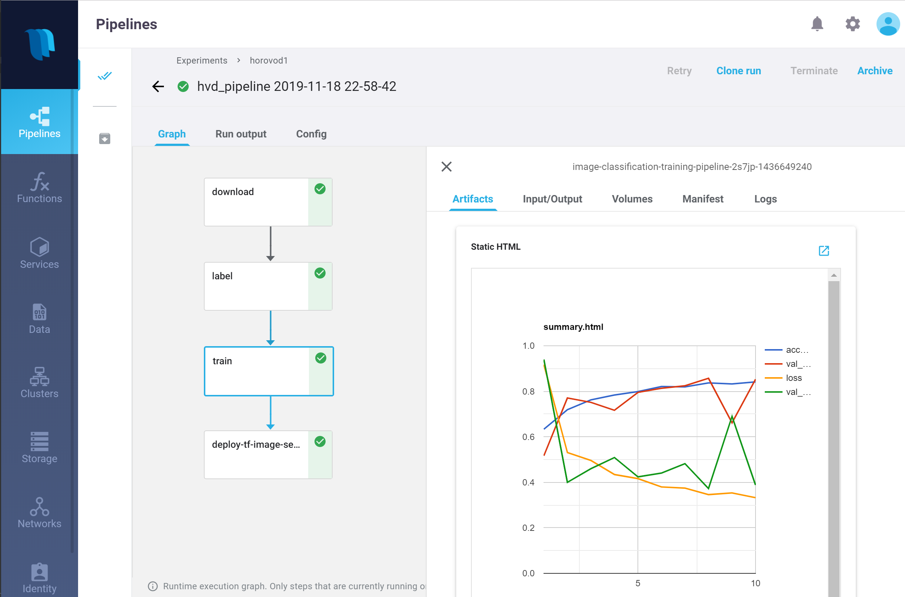

# Horovod Demo: Image Classification with Distributed Training

This demo demonstrates an end-to-end image-classification solution using [TensorFlow](https://www.tensorflow.org/) (versions 1 or 2), [Keras](https://keras.io/), [Horovod](https://eng.uber.com/horovod/), and [Nuclio](https://nuclio.io/).

The demo consists of four MLRun and Nuclio functions and a Kubeflow Pipelines orchestration:

1. **Download**: Import an image archive from AWS S3 to your cluster's data store.
2. **Label**: Tag the images based on their name structure.
3. **Training**: Perform distributed training using TensorFlow, Keras, and Horovod.
4. **Inference**: Automate deployment of a Nuclio model-serving function.

> **Note:** The demo supports both TensorFlow versions 1 and 2.
> There's one shared notebook and two code files &mdash; one for each TensorFlow version.

 

 

## Pipeline Output

 

 

