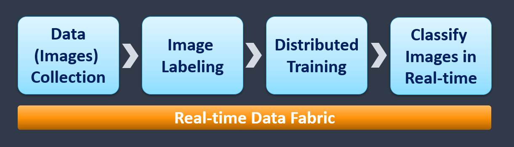

# Image Classification Using Distributed Training

This example is using TensorFlow, Horovod, and Nuclio demonstrating end to end solution for image classification, 
it consists of 4 MLRun and Nuclio functions:

1. import an image archive from S3 to the cluster file system
2. Tag the images based on their name structure 
3. Distrubuted training using TF, Keras and Horovod
4. Automated model deployment using Nuclio (serverless)

 

 

## Notebooks & Code

* [All-in-one: Import, tag, launch training, deploy serving](mlrun_mpijob_classify.ipynb) 
* [Serving function development and testing](nuclio-serving-tf-images.ipynb)
* [KubeFlow pipelines workflow - TBD]()
* [Training function code](horovod-training.py)
