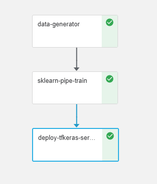

# **Scikit-Learn and KubeFlow With MLRun**

In this set of notebooks and functions we build an sklearn `Pipeline` into a KubeFlow pipeline.  The sklearn `Pipeline` component is composed of 2 steps and is embodied within the Kubeflow training step. It performs feature engineering, scaling and fitting using components that are themselves parameters, making the Kubeflow pipeline appear more generic and thus more amenable to further automation.

So for example, this Kubeflow pipeline could have its input models determined by 3 other pipelines that search over a wider sample of model structures. 

And with MLRun, each step, of each pipeline, could have its own highly optimized/customized runtime with metrics and other data logged by the MLRun db and accessible through the Iguazia data fabric. 

 

 
