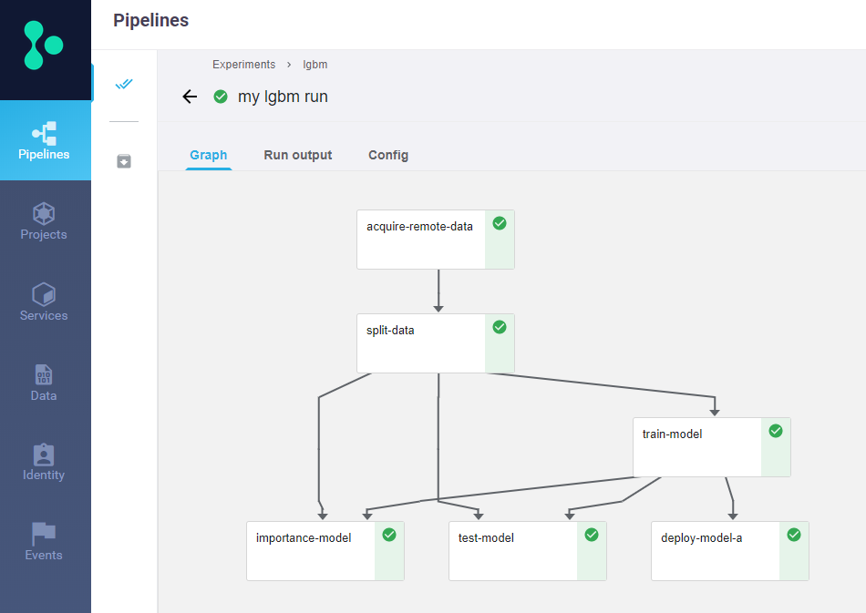

# Instructions for LightGBM demo

Run the notebooks in the following order, and pay close attention to the instructions
as you work through the cells.  **Make sure to run all the cells, including the commented
cells**. Also, don't try running the entire workbook in one go until you have worked
through it, as there may be sections that should only be run once.

1. Setup the server using [model server](model-server.ipynb).
2. Design a machine learning pipeline using [kubeflow pipeline](kubeflow-pipeline.ipynb)

Enjoy!