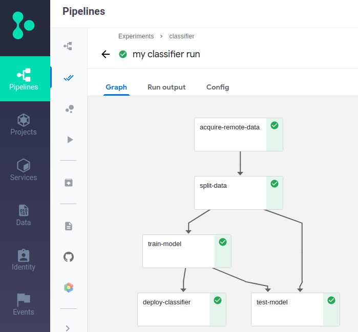

# LightGBM and KubeFlow with MLRun: UCI HIGGS dataset

In this set of notebooks we build a simple classification model using the **[HIGGS](https://archive.ics.uci.edu/ml/datasets/HIGGS)** dataset and the **[LightGBM](https://lightgbm.readthedocs.io/en/latest/)** package. The model is embedded into a **[KubeFlow](https://www.kubeflow.org/)** **[pipeline](https://www.kubeflow.org/docs/pipelines/)**.

Enjoy!
