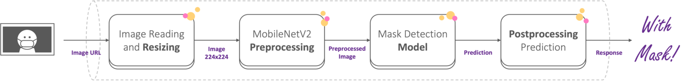
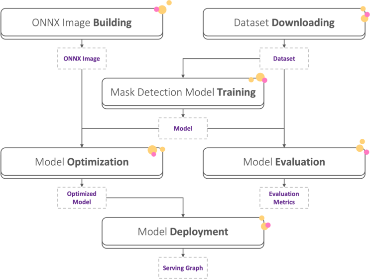

# Mask Detection Demo

In the following demo we will demonstrate how to use MLRun to create a mask detection app. We'll train a model that classifies an image of a person as wearing a mask or not, and serve it to an HTTP endpoint. 

### Key Technologies:

* Either [**TF.Keras**](https://www.tensorflow.org/api_docs/python/tf/keras) or [**PyTorch**](https://pytorch.org/) to train and evaluate the model
* [**Horovod**](https://horovod.ai/) to run distributed training
* [**ONNX**](https://onnx.ai/) to optimize and accelerate the model's performance
* [**Nuclio**](https://nuclio.io/) to create a high-performance serverless Serving function
* [**MLRun**](https://www.mlrun.org/) to orchestrate the process

### Credits:
* The model is trained on a dataset containing images of people with or without masks. The data used was taken from **Prajna Bhandary**, [github link](https://github.com/prajnasb/observations). 
* The training code is taken from Adrian Rosebrock, COVID-19: Face Mask Detector with OpenCV, Keras/TensorFlow, and Deep Learning, **PyImageSearch**, [page link](https://www.pyimagesearch.com/2020/05/04/covid-19-face-mask-detector-with-opencv-keras-tensorflow-and-deep-learning/), accessed on 29 June 2021.

### Notebooks:
The demo is split among 3 notebooks and it is important to run them sequentially as each relies on the previous one:

1. [**Training and Evaluation**](./1-training-and-evaluation.ipynb) - Build the mask detection model and run training and evaluation with MLRun's deep learning auto-logging and distributed training (using Horovod).

2. [**Serving**](./2-serving.ipynb) - Serve the model we trained as an HTTP endpoint, demonstrating a serving graph where we preprocess the images before and after,  inferring them through the model:

3. [**Automatic Pipeline**](./3-automatic-pipeline.ipynb) - Build an automatic pipeline, using the MLRun functions from notebooks 1 and 2 with an additional step: optimizing (using ONNX).

We hope you enjoy using MLRun!
