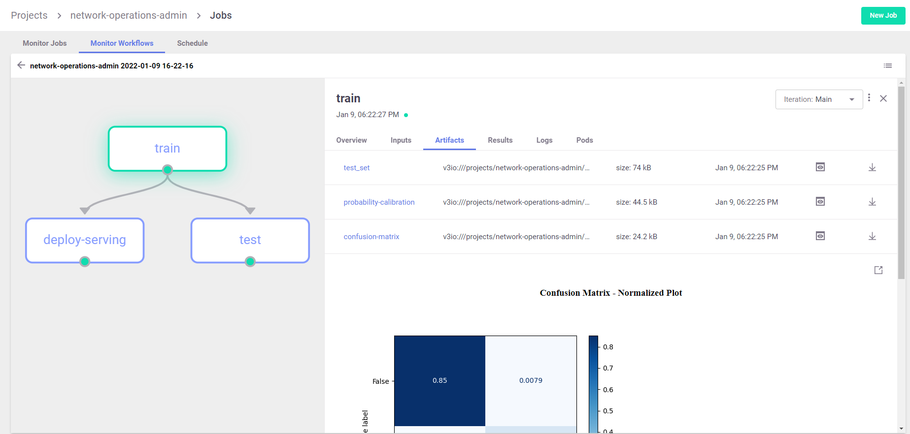

# NetOps Demo: Predictive Network Operations/Telemetry

[Overview](#overview)&nbsp;| [Running the Demo](#demo-run)&nbsp;| [Demo Flow](#demo-flow)&nbsp;|  [Notebooks and Code](#notebooks-and-code)

## Overview

This demo demonstrates how to build an automated machine-learning (ML) pipeline for predicting network outages based on network-device telemetry, also known as Network Operations (NetOps).
The demo implements feature engineering, model training, testing, inference, and model monitoring (with concept-drift detection).
The demo is using a offline/real-time metrics simulator to generate semi-random network telemetry data that will be used across the pipeline.

The demo demonstrates how to

- Manage MLRun projects.
- Use GitHub as a source for functions to use in pipeline workflows.
- Use MLRun Feature Store to ingest, calculate and serve offline and real-time features
- Use MLRun Pipeline orchestration for running an automated train, test, and deploy pipeline and tracking the results and artifacts
- Use MLRun Serving Graphs to build real-time ML applications and serve models.
- Use MLRun Model monitoring and drift analysis.

> **Note:** The demo applications are tested on the [Iguazio Data Science Platform](https://www.iguazio.com) ("the platform"), and use the platform's data store ("v3io").
> Contact [Iguazio support](mailto:support@iguazio.com) to request a free trial of the platform.

<a id="demo-run"></a>
## Running the Demo

<a id="demo-run-prerequisites"></a>
### Prerequisites

Before you begin, ensure that you have the following:

- A [Kubernetes](https://kubernetes.io/) and [Nuclio](https://nuclio.io/).
- An installation of MLRun with a running MLRun service and an MLRun dashboard.
    See details in the [MLRun README](https://github.com/mlrun/mlrun).

<a id="demo-execution-steps"></a>
### Execution Steps

Execute the following steps to run the demo:

1. Fork the [mlrun/demos](https://github.com/mlrun/demos) Git repository to your GitHub account.

2. In a client or notebook that is properly configured with MLRun, run the following code; replace `<your fork>` with the name of your mlrun/demos GitHub fork:
    ```
    git clone https://github.com/<your fork>.git
    cd demos/network-operations
    ```

3. Run the [**01-ingest.ipynb**](01-ingest.ipynb) notebook to create the feature sets and deploy the data generator and live ingestion endpoints.

4. Open the [**02-training-and-deployment.ipynb**](02-training-and-deployment.ipynb) notebook and follow the instructions to create a Feature Vector, and run an automated pipeline to train a model and deploy it for live real-time predictions.

<a id="demo-flow"></a>
## Demo Flow

The demo consists of:
1. **Building** and testing features from three sources (device metadata, real-time device metrics, and real-time device labels) using the feature store
2. **Ingesting** the data using batch (for testing) or real-time (for production)
3. **Running** an automated ML pipeline (train, test, and deploy the model with data from the feature-store)
4. **Testing** the deployed real-time feature engineering and inference pipeline
5. **Monitoring** the model serving data, metrics and detecting drift

<a id="feature-creation"></a>
### Feature Creation and Ingestion

In the feature creation stage we use MLRun's Feature Store to first define the features we are want to ingest and the operations we want to apply to them.  
In this demo we create 3 unique feature sets:
- **network-device metrics** &mdash; real-time network-device telemtry data such as cpu utilization, packet loss, latency, throughput. We will run real-time aggregations on top of these metrics with different time windows.
- **static network-device data** &mdash; static device data such as his model and manufacturing country. We will one-hot-encode the categorical features to have them ready for model ingestion.
- **network-device failure label indicator** &mdash; a stream representing the label responses. The Feature Store will later match them with the correct sample for dataset creation.

After the 3 features sets are defined we demonstrate how to ingest the features data using batch or real-time techniques.

<a id="model-training"></a>
### Automated Model Training and Deployment (CI/CD)

Now that we have our dataset ready for training, we need to define our model training, testing and deployment process.

We build an automated ML pipeline which uses pre-baked serverless training, testing and serving functions from [MLRun's functions marketplace](https://www.mlrun.org/marketplace/), the pipeline has three steps:
* **Train** a model using data from the feature vector we created and save it to the model registry
* **Test** and evaluate the model with portion of the data
* **Deploy** a real-time serving function which use the newly trained model and enrich/impute the features with data from the real-time feature vector 



You can see the [**workflow code**](./src/workflow.py), we can run this workflow locally, in a CI/CD framework, or over Kubeflow. 
In practice we may create different workflows for development and production.

The workflow/pipeline can be executed using the MLRun SDK (`project.run()` method) or using CLI commands (`mlrun project`), 
and can run directly from the source repo (GIT), see details in MLRun [**Projects and Automation documentation**](https://docs.mlrun.org/en/latest/projects/overview.html).

<a id="model-Deployment-and-monitoring"></a>
### Data and Model Monitoring

The deployed real-time pipeline generates real-time telemetry and gathers the model inputs and outputs data, the telemetry 
metrics and real-time data are used for:
* monitoring model activity, performance, health 
* monitoring real-time model and data statistics, drift and accuracy
* gathering production data for use in post analysis (explanability) and re-training 

We will then be able to view MLRun's Model Montoring results in MLRun UI or in Grafana dashboards.


<a id="notebooks-and-code"></a>
## Notebooks and Code

<a id="notebooks"></a>
### Notebooks and Code

- [**01-ingest.ipynb**](01-ingest.ipynb) &mdash; the 1st demo step notebook. including project setup, genetaor deployment, feature sets creation and deployment.
- [**02-training-and-deployment.ipynb**](02-training-and-deployment.ipynb) &mdash; the 2nd demo step notebook. including feature vecto creation, dataset creation, model training, deployment and testing.
- [**src/generator.py**](src/generator.py) &mdash; a nuclio function to generate live network-device telemetry and publish it to a v3io stream.
- [**src/workflow.py**](src/workflow.py) &mdash; ML Pipeline for training, tests, and model deployment

<a id="project-cfg-files"></a>
### Project-Configuration Files

- [**src/metric_configurations.yaml**](src/metric_configurations.yaml) &mdash; a data-generator configurations file. defines the metrics for the demo's generator network-device telemetry data.

