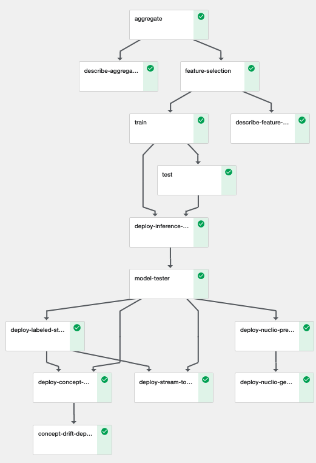
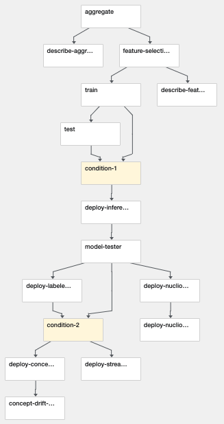

# Network Operations - MLRun MLOps Demo
---
This demo shows a full ML Pipeline for error prediction based on network device telematry using MLRun.

In this demo we show:
- Managing an MLRun Project
- Using github as a source for functions to use in our pipeline workflows
- Use MLRun logging to track results and artifacts
- Running a Kubeflow Pipeline using MLRun
- Deploy live endpoints
- Deploy Concept Drift

The demo applications are tested on the Iguazio's Data Science PaaS, and use Iguazio's shared data fabric (v3io), and can be modified to work with any shared file storage by replacing the `apply(v3io_mount())` calls with other KubeFlow volume modifiers (e.g. `apply(mlrun.platforms.mount_pvc())`) . You can request a free trial of Iguazio PaaS.

## How the system is built
This demo aims to show an example of a production system deployed fully by an automated pipeline.

There are three main parts to this demo.
- Training pipeline to create new model.
- Streaming pipeline endpoints for production
- Concept Drift detection to monitor the model's performance 

You can select which parts of the workflow to run via the `deploy_streaming` flag for the Production deployment and the `deploy_concept_drift` for the drift detection flags.

For retraining purposes and scheduling of workflows we can use the [project runner]() function from the marketplace to create an HTTP endpoint (or any other nuclio trigger) that can run a workflow based on an event.  

### Training pipeline
The training pipeline includes the following process (based on our [functions market](https://github.com/mlrun/functions)):  
**[Exploratory Data Analysis](https://github.com/mlrun/functions/blob/master/describe/describe.ipynb):** Provides histogram maps, class imbalance, correlation matrix, etc...  
**[Aggregation](https://github.com/mlrun/functions/tree/master/aggregate/aggregate.ipynb):** run different rolling aggregations on top of the dataset to create temporal features.  
**[Feature Selection](https://github.com/mlrun/functions/blob/master/feature_selection/feature_selection.ipynb):** Select the best features to use using a vote based on multiple metrics and basic model estimators.  
**[Training](https://github.com/mlrun/functions/blob/master/sklearn_classifier/sklearn_classifier.ipynb):** Train multiple SKLearn API based models (Using automated hyperparams search) and select the best one according to a selected metric.  
**[Test](https://github.com/mlrun/functions/blob/master/test_classifier/test_classifier.ipynb):** Using a dedicated Test dataset, provide performence benchmarks for the model.

### Production deployment pipeline
In the production deployment phase we aim to deploy a full system to ingest new data, create the necessary features and provide predictions.
We are using the Nuclio serverless runtime to create the live endpoints, which for ease-of-use as open source will work by passing parquets at a set directory between each other. (Using a streaming engine would require many dependencies which will make open-source deployment difficult)

Our production process is made of a setup stage to start the [generator](notebooks/generator.ipynb) to mimic incoming data and the [(done automatically in the pipeline). 
The netops pipeline itself is made from the following components:  
**[Preprocessor](notebooks/preprocessor.ipynb):** Taking the selected features and creating them upon ingestion.  
**[Model Server](notebooks/server.ipynb):** Deploy the model to a live endpoint.  
**[Model Server Tester](https://github.com/mlrun/functions/blob/master/model_server_tester/model_server_tester.ipynb):** Verify our model endpoint is live and provides good predictions.  
**[Labeled stream creator](notebooks/labeled_stream_creator.ipynb):** Join the incoming labels and predictions to a single source to assess the model's performence.

### Concept drift deployment pipeline
The concept drift pipeline is made of two main components:  
**[Concept Drift Detectors](https://github.com/mlrun/functions/blob/master/concept_drift/concept_drift.ipynb):** Using streaming drift detectors like DDM and PH.
we use a `job` to initialise the models with a base labeled dataset and produce a live Nuclio endpoint to enlist to the labeled stream.  
**[Drift Magnitude](https://github.com/mlrun/functions/blob/e236a6b006e9e5a095a93c4822e422ebce5ac2dc/virtual_drift/virtual_drift.ipynb):** Taking batches of data via parquet, we apply multiple drift magnitude metrics like TVD, Helinger and KL Divergence to assess the drift between a base dataset and the latest data.

 

 

## Running the demo
---
Pre-requisites:
* A Kubernetes cluster with pre-installed KubeFlow, Nuclio.
* MLRun Service and UI installed, [see MLRun readme](https://github.com/mlrun/mlrun).

1. Clone this repo to your own Git. 
2. in a client or notebook properly configured with MLRun and KubeFlow run:

`mlrun project demos/network-operations/ -u git://github.com/<your-fork>/demos/network-operations.git`

3. Run the [Generator](notebooks/generator.ipynb) notebook to create the metrics dataset.

4. Open the [project notebook](project.ipynb) and follow the instructions to develop and run an automated ML Pipeline.

> Note: alternatively you can run the `main` pipeline from the CLI and specify artifacts path using:

`mlrun project demos/network-operations/ -r main -p "/User/kfp/{{workflow.uid}}/"`

## Files
### Notebooks
* [Generator notebook (Generate metrics dataset)](notebooks/generator.ipynb)
* [Preprocessor notebook](notebooks/preprocessor.ipynb)
* [Model server notebook](notebooks/server.ipynb)
* [Labeled stream creator](notebooks/labeled_stream_creator.ipynb)
* [Project creation and testing notebook](project.ipynb) 

### Project Files
* [Project spec (functions, workflows, etc)](project.yaml)

### Workflow code
* [Workflow code (init + dsl)](src/workflow.py)

## Pipeline

 

 

