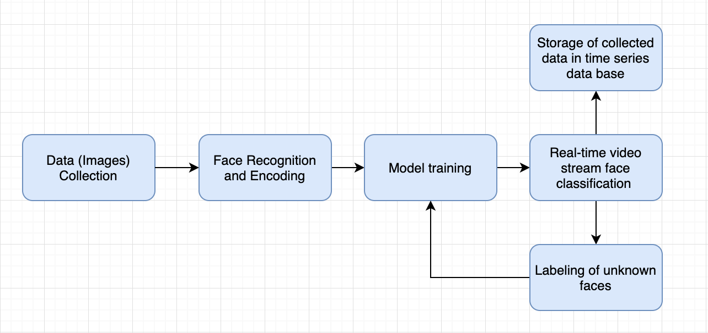

# Faces Demo: Real-Time Image Recognition with Deep Learning

This demo uses [OpenCV](https://opencv.org/), [PyTorch](https://pytorch.org), and [Nuclio](https://nuclio.io/) to demonstrate an end-to-end solution for real-time face recognition over a video stream.

The demo consists of five MLRun and Nuclio functions:

1. Face recognition and encoding in photos using the OpenCV deep-learning model &mdash; from a [notebook](notebooks/face-recognition.ipynb).
2. Model training and an output PyTorch predictor based on the extracted encodings &mdash; from a [notebook](notebooks/face-recognition.ipynb).
3. Automated deployment of a Nuclio function for serving the training model &mdash; from a [notebook](notebooks/nuclio-face-prediction.ipynb).
4. A client that records video, streams the data to the platform's data store (file system), and triggers the serving function &mdash; see [**client/README.md**](client/README.md).
5. Labeling of unrecognized faces using an interactive dashboard built with [Streamlit](https://www.streamlit.io/) &mdash; from [code](./streamlit/dashboard.py).

The demo also demonstrates implementation of an automated pipeline from a [notebook](notebooks/face-recognition.ipynb) using MLRun and [Kubeflow Pipelines](https://www.kubeflow.org/docs/pipelines/), including using the Iguazio Data Science Platform's NoSQL (key-value) data store and time-series database (TSDB) library to store metadata and track data of the identified and unidentified faces.

## Pipeline Output
 
 

 

## Notebooks and Code

- [Video-streaming client](client/README.md)
- [All-in-one: import, launch training, deploy a serving function](notebooks/face-recognition.ipynb)
- [Serving-function development and testing](notebooks/nuclio-face-prediction.ipynb)
- [Client for streaming data to the Iguazio Data Science Platform](client/video_capture.py)
- [Labeling of unknown images and model retraining for newly collected data](./streamlit/dashboard.py)

