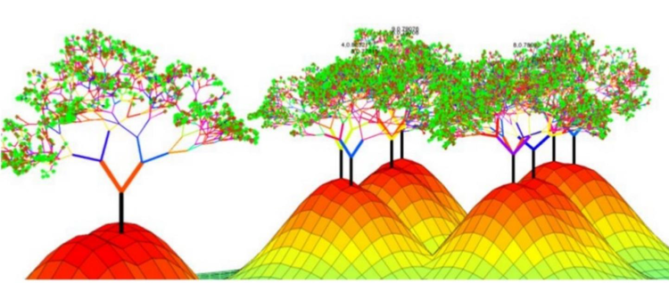
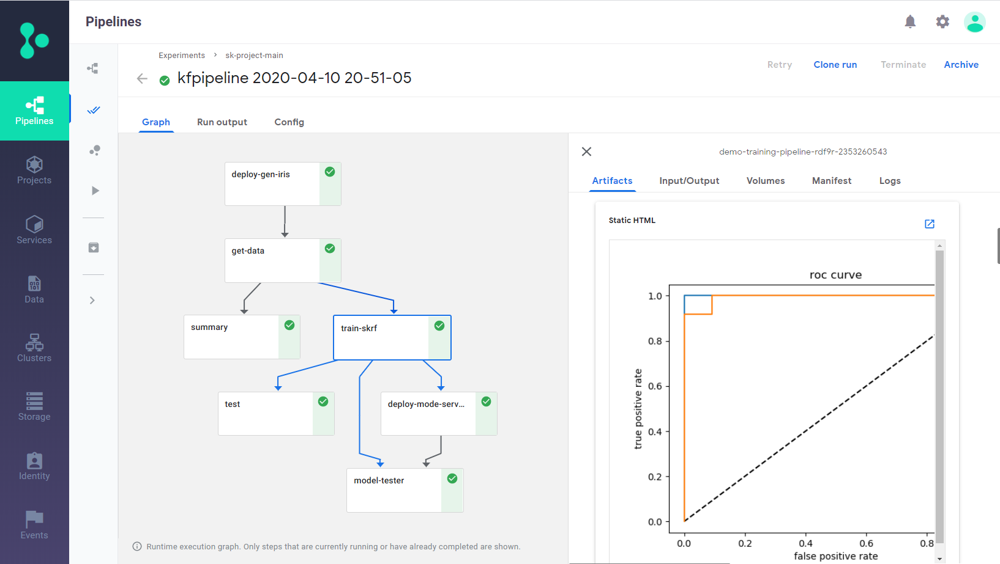

# scikit-learn Demo: Full AutoML Pipeline

This demo demonstrates how to build a full end-to-end automated-ML (AutoML) pipeline using [scikit-learn](https://scikit-learn.org) and the UCI [Iris data set](http://archive.ics.uci.edu/ml/datasets/iris).

The combined CI/data/ML pipeline includes the following steps:

- Create an Iris data-set generator (ingestion) function.
- Ingest the Iris data set.
- Analyze the data-set features.
- Train and test the model using multiple algorithms (AutoML).
- Deploy the model as a real-time serverless function.
- Test the serverless function's REST API with a test data set.

See the [**sklearn-project.ipynb**](./sklearn-project.ipynb) notebook for details.
 
To run the demo, download this notebook into an empty directory and execute the cells sequentially.

 

 

## Pipeline Output

The output plots can be viewed as static HTML files in the [**plots**](./plots) directory.

 

 

