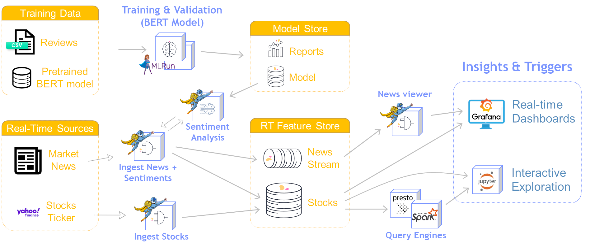
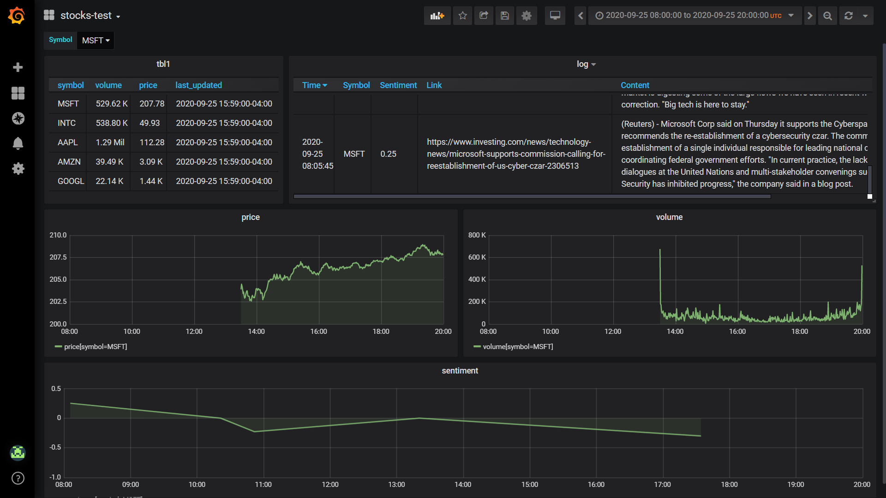
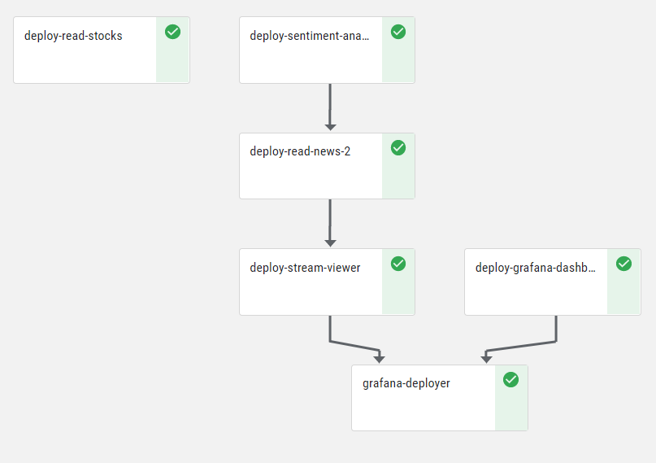

# Stock-Analysis Demo

[Overview](#overview)&nbsp;| [Running the Demo](#demo-run)&nbsp;| [Demo Flow](#demo-flow)&nbsp;| [Pipeline Output](#pipeline-output)&nbsp;| [Exploring the Data](#data-exploration)&nbsp;| [Notebooks and Code](#notebooks-and-code)

## Overview

This demo tackles a common requirement of running a data-engineering pipeline as part of machine-learning (ML) model serving by reading data from external data sources and generating insights using ML models.
The demo reads stock data from an external source, analyzes the related market news, and visualizes the analyzed data in a Grafana dashboard.

The demo demonstrates how to

- Train a sentiment-analysis model using the Bidirectional Encoder Representations from Transformers ([BERT](https://github.com/google-research/bert)) natural language processing (NLP) technique, and deploy the model.
- Deploy Python code to a scalable function using [Nuclio](https://nuclio.io/).
- Integrate with the real-time multi-model data layer of the Iguazio Data Science Platform ("the platform") &mdash; time-series databases (TSDB) and NoSQL (key-value) storage.
- Leverage machine learning to generate insights.
- Process streaming data and visualize it on a user-friendly dashboard.

<a id="demo-run"></a>
## Running the Demo

<a id="prerequisites"></a>
### Prerequisites

The demo is preconfigured to run on the Iguazio Data Science Platform ("the platform").
Before you begin, ensure that the following prerequisites are met:

1.  MLRun is installed in your Conda environment.
    You can install MLRun by running the following code:
    ``` sh
    python -m pip install mlrun
    ```
2.  You have a running Grafana service named "grafana".
    You can add a new Grafana service from the **Services** page of the platform dashboard.
    If you need permissions to create or access the Grafana dashboard, contact your system administrator.

<a id="demo-execution-steps"></a>
### Execution Steps

To run the demo, open and run the [**project.ipynb**](project.ipynb) notebook run the code cells according to the instructions in the notebook.

<a id="demo-flow"></a>
## Demo Flow

The demo include the following steps:

1.  [**Training and validating the model**](#training-and-validation) (BERT Model).
    By default, the pipeline downloads a pre-trained model to save time.
2.  [**Deploying a sentiment-analysis model server**](#sentiment-analysis-model-server).
3.  [**Ingesting stock data**](#stock-data-ingestion).
4.  [**Scraping stock news and analyzing sentiments**](#stock-news-scraping-and-sentiment-analysis) to generate sentiment predictions.
5.  [**Deploying a stream viewer**](#stream-viewer) that reads data from the stocks news and sentiments stream and can be used as a Grafana data source.
6.  [**Visualizing the data on a Grafana dashboard**](#grafana-dashboard), using the stream viewer as a data source.

The following image demonstrates the demo flow:

<p></p>

<a id="training-and-validation"></a>
### Training and Validating the Model (BERT Model)

This optional step trains and validates an ML model (see the [**00-train-sentiment-analysis-model.ipynb**](code/00-train-sentiment-analysis-model.ipynb) notebook).
The code downloads the pre-trained hugging-face transformers BERT base model (["bert-base-cased"](https://huggingface.co/bert-base-cased)) and further trains it by using a custom local customer-reviews CSV file ([**data/reviews.csv**](data/reviews.csv)).
This yields a sentiment-analysis model based on the prior knowledge of BERT.

> **Note:** Because the training can take some time, by default the demo pipeline downloads a [pre-trained model](https://iguazio-sample-data.s3.amazonaws.com/models/model.pt) instead of running the training notebook.
> To run the training process as part of the pipeline, change the value of the `RUN_TRAINER` environment variable to `True` in the [**project.ipynb**](project.ipynb) notebook.

<a id="sentiment-analysis-model-server"></a>
### Deploying a Sentiment-Analysis Model Server

This step defines and deploys a Nuclio function for serving a sentiment-analysis model (see the [**project.ipynb**](project.ipynb) notebook).
The model server is given a list of texts, and uses the trained BERT model to generate a list of labels corresponding to its sentiment predictions.
The labels express the sentiment of the writer towards the topic of the text:

- `(-1)` signifies a negative sentiment.
- `0` signifies a neutral sentiment.
- `1` signifies a positive sentiment.

<a id="stock-data-ingestion"></a>
### Ingesting Stock Data

This step defines and deploys a Nuclio function that ingests stock data (see the [**01-read-stocks notebook.ipynb**](code/01-read-stocks.ipynb) notebook).
The function ingests real-time stock information from an internet service into the platform's data store:
the stock data (symbol, price, and volume) and related metadata are saved to a NoSQL table, and the stock metrics (price and volume) are also saved to a TSDB table.
When initially loaded, the function updates the tables with data for the last 7 days (i.e., the last week).
Then, the function is triggered every 5 minutes and updates the tables with the data for this interval.

<a id="stock-news-scraping-and-sentiment-analysis"></a>
### Scraping Stock News and Analyzing Sentiments

This step defines and deploys a Nuclio function that ingests stock news and sentiments and performs sentiment analysis to generate sentiment predictions (see the [**02-read-news.ipynb**](code/02-read-news.ipynb) notebook).
The function is triggered every 5 minutes.
It reads the latest news updates for the selected stock symbols ("scrapes" stocks news), and uses the sentiment-analysis model server to calculate stock sentiments.
The news and sentiments are saved to a data stream and to NoSQL and TSDB tables in the platform's data store.

<a id="stream-viewer"></a>
### Deploying a Stream Viewer

This step defines a deploys a Nuclio function that implements a real-time HTTP stream viewer that reads data from the stock news and sentiments stream that was created in the previous step (see the [**03-stream-viewer.ipynb**](code/03-stream-viewer.ipynb) notebook).
This viewer is used as a Grafana data source in the next step.

<a id="grafana-dashboard"></a>
### Visualizing the Data on a Grafana Dashboard

This step deploys a Grafana dashboard for visualizing the stock data and sentiments (see the [**04-grafana.ipynb**](code/04-grafana.ipynb) notebook).
The dashboard uses the `iguazio` Grafana data source and a newly defined `stream-viewer` data source that uses the stream viewer that was created in the previous step.

The following image demonstrates the visualization of the pipeline output on a Grafana dashboard:

<p></p>

<a id="pipeline-output"></a>
## Pipeline Output

The following image illustrates the generated pipeline:

<p></p>

As outlined in the demo flow, you can view the output on a [Grafana dashboard](#data-visualization).

You can then proceed to explore the data.

<a id="data-exploration"></a>
## Exploring the Data

After you run the demo pipeline, you can explore the data.
The [**05-explore.ipynb**](code/05-explore.ipynb) notebook demonstrates how to leverage the platform's real-time multi-model data layer to read and review the data using query engines such as Spark and Presto.
You can also generate time-series graphs such as the following:

<p></p>

<a id="notebooks-and-code"></a>
## Notebooks and Code

- [**project.ipynb**](project.ipynb) &mdash; the main demo notebook ("all in one"), including the definition and deployment of the sentiment-analysis model server (Nuclio function).
    Run this notebook to execute the entire pipeline.
- [**00-train-sentiment-analysis-model.ipynb**](code/00-train-sentiment-analysis-model.ipynb) &mdash; model training and validation (BERT model).
- [**01-read-stocks.ipynb**](code/01-read-stocks.ipynb) &mdash; deployment of a Nuclio function for ingesting stock data (symbol, price, and volume).
- [**02-read-news.ipynb**](code/02-read-news.ipynb) &mdash; deployment of a Nuclio function for ingesting stock news and sentiments.
- [**03-stream-viewer.ipynb**](code/03-stream-viewer.ipynb) &mdash; creation of a viewer for the stock news and sentiments stream that can be used as a Grafana data source.
- [**04-grafana.ipynb**](code/04-grafana.ipynb) &mdash; deployment of a Grafana dashboard.
- [**05-explore.ipynb**](code/05-explore.ipynb) &mdash; exploration of the pipeline data.

