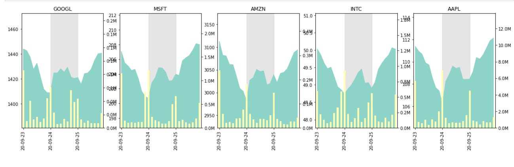

# Stock-Analysis Demo

A common requirement is to run your data-engineering pipeline as part of the ML model serving.
This is often done by reading data from external data sources and generating insights using machine-learning models.
This demo does this for stock data:
the demo reads stock data from an external source, analyzes the related market news, and visualizes the analyzed data in a Grafana dashboard.

The demo demonstrates how to do the following:

1. Train a sentiment-analysis model using BERT, and deploy the model.
2. Deploy Python code to a scalable function (using Nuclio).
3. Integrate with the real-time multi-model data layer of the Iguazio Data Science Platform ("the platform") &mdash; time-series databases (TSDB) and NoSQL (key-value) storage.
4. Leverage machine learning to generate insights.
5. Process streaming data to a user friendly dashboard.

<a id="demo-flow"><a/>
## Demo Flow

The following image demonstrates the demo flow:


<a id="prerequisites"></a>
## Prerequisites

This demo is preconfigured to run on the Iguazio Data Science Platform ("the platform").

Ensure that MLRun is installed in your Conda environment.
You can install MLRun by running the following code:
``` sh
python -m pip install mlrun
```

Also ensure that you have a Grafana service named `grafana`.
You can add a new Grafana service from the **Services** page of the platform dashboard.
If you need permissions to create or access the Grafana dashboard, contact your system administrator.

<a id="demo-run"></a>
## Running the Demo

To run the demo, open and run the [**project.ipynb**](project.ipynb) notebook, and run the pipeline.

This will create a pipeline, as shown in the following image:


The pipeline output is visualized in a Grafana dashboard, as demonstrated in the following image:


You can review the output using the [**05-explore.ipynb**](code/05-explore.ipynb) notebook with Spark and Presto, as well as generate time-series graphs such as the following:



<a id="notebooks-and-code"></a>
## Notebooks and Code

- [**project.ipynb**](project.ipynb) &mdash; the main notebook.
    Run this notebook for the entire pipeline.
- [**00-train-sentiment-analysis-model.ipynb**](code/00-train-sentiment-analysis-model.ipynb) &mdash; model training and validation (BERT model).
- [**01-read-stocks.ipynb**](code/01-read-stocks.ipynb) &mdash; deploy the stock symbol price and volume Nuclio function.
- [**02-read-news.ipynb**](code/02-read-news.ipynb) &mdash; deploy the news reader Nuclio function.
- [**03-stream-viewer.ipynb**](code/03-stream-viewer.ipynb) &mdash; create a source of the news stream for Grafana.
- [**04-grafana.ipynb**](code/04-grafana.ipynb) &mdash; deploy the Grafana dashboard.
- [**05-explore.ipynb**](code/05-explore.ipynb) &mdash; explore the output.

<a id="training-n-validation"></a>
## Training and Validating the Model (BERT Model)

This step is implemented by the [**00-train-sentiment-analysis-model.ipynb**](code/00-train-sentiment-analysis-model.ipynb) notebook.

> **Note:** You can optionally download a pre-trained version of this model and skip this step.

The training notebook downloads the pre-trained huggingface transformers BERT model ([bert-base-cased model](https://huggingface.co/bert-base-cased)) and further trains it using a custom local customer-reviews CSV file ([**data/reviews.csv**](data/reviews.csv)).
This yields a sentiment-analysis model based on the prior knowledge of BERT.

You can run the training process as part of the pipeline by changing `RUN_TRAINER` to `True` in the [**project.ipynb**](project.ipynb) notebook.

<a id="sentiment-analysis"></a>
## Analyzing Stock Sentiments

The model server is given a list of texts and outputs a list of labels corresponding to its prediction. The labels express the sentiment of the writer towards the topic of the text:

- (-1) for negative sentiment.
- 0 for neutral sentiment.
- 1 for positive sentiment.

This step deploys a Nuclio function called `stocks-sentiment-analysis` that serves the model. The model file can be downloaded from <https://iguazio-sample-data.s3.amazonaws.com/models/model.pt>.

<a id="news-and-sentiments-ingestion"></a>
## Ingesting News and Sentiments

This step deploys a Nuclio function called `stocks-read-news` which is triggered every 5 minutes. The function reads the latest news updates for the selected stock symbols, calculates their sentiment based on the sentiment analysis function, and updates the feature store with the news stream as well as updates to the stock sentiment in the time-series database.

You can review the code and deploy this function with the [**read-news notebook**](code/02-read-news.ipynb).

<a id="stocks-ingestion"></a>
## Ingesting Stock Data

This step deploys another Nuclio function named `stocks-read-stocks`.
When initially loaded, the function updates the feature store with the stock prices and volume of the last 7 days.
Then, the function is triggered every 5 minutes and updates the feature store with the stock prices and volume data of that interval.

You can review the code and deploy this function with the [**read-stocks notebook**](code/01-read-stocks.ipynb).

<a id="data-visualization"></a>
## Visualizing the Data with a News Viewer and a Grafana Dashboard

The news stream in the feature store is read by the stream viewer ([**code/03-stream-viewer.ipynb**](code/03-stream-viewer.ipynb)), which serves as a data source for the Grafana dashboard.
The dashboard is created programmatically from the Grafana notebook ([**code/04-grafana.ipynb**](code/04-grafana.ipynb)).

<a id="data-exploration"></a>
## Exploring the Data

Use the Iguazio real-time multi-model data layer to read data using query engines, such as Spark and Presto to explore the data.
