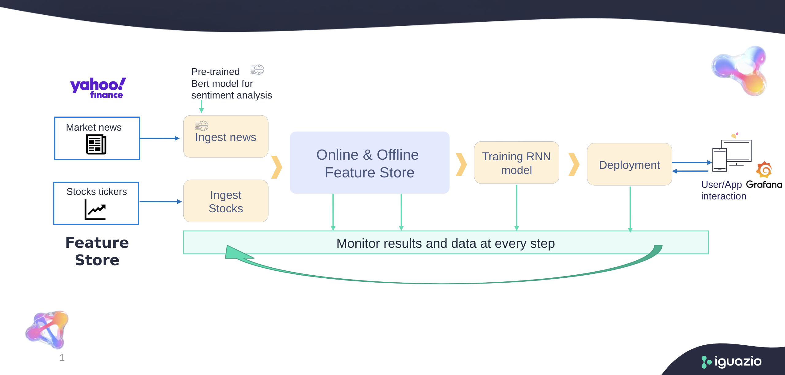

# Stock-Prediction Demo
_____
[Overview](#overview)| [Running the Demo](#running-the-demo)|[Execution Steps](#execution-steps)|[Demo Flow](#demo-flow)|[Notebooks and Code](#notebooks-and-code)

## **Overview**
_____
This demo provide an example for using iguazio's latest technolegies and methods;
* Model Serving - Using mlrun api to create scaleable pretrained sentiment-analysis model serving function as part of larger mlrun's serving graph (data-engineering pipeline)
* Feature Store - Managing data for machine learning projects, provides convienent way for feature-engineering (aggregation etc) and both online & offline stored data access.
* Mlrun frameworks - MLRun is providing a quick and easy integration into your code with mlrun.frameworks: a collection of sub-modules for the most commonly used machine and deep learning frameworks, providing features such as automatic logging, model management, and distributed training.

## **Running the Demo**
_____
**Prerequisites**  
The demo is preconfigured to run on the Iguazio Data Science Platform ("the platform"). Before you begin, ensure that the following prerequisites are met:
1. MLRun is installed in your Conda environment. You can install MLRun by running the following code:
` python -m pip install mlrun `
2. You have a running Grafana service named "grafana". You can add a new Grafana service from the Services page of the platform dashboard. If you need permissions to create or access the Grafana dashboard, contact your system administrator.

## **Execution Steps**
_____
1. Run `01_ingest_news.ipynb` and `02_ingest_stocks.ipynb` to deploy two Feature-Store ingestion services, one for stocks data and one for stocks news data from yahoo api.
2. Run `05_stocks_pipeline.ipynb` for creating kubeflow-pipeline with model-training and serving functions to train and deploy RNN model to predict stocks prices.
   OR not using kfpipeline and run notebooks `03_model_training.ipynb` and `04_model_serving.ipynb`
3. Run `06_grafana_view.ipynb` to create a Grafana dashbord for model analysis.

## **Demo Flow**
_____

### **Deploying a Sentiment-Analysis Model Server**
_____
This step defines and deploys a Nuclio function for serving a sentiment-analysis model (see news.py). The model server is given a string, and uses the pretrained BERT model to generate a label corresponding to its sentiment prediction. The label express the sentiment of the writer towards the topic of the text:

* (0) signifies a negative sentiment.
* 0.5 signifies a neutral sentiment.
* 1 signifies a positive sentiment.

### **Using the Feature-Store**
_____
With the Feature-Store we are able to create scalable, performant data pipelines to transform raw data into features, using the ingestion service endpoint to trigger our data pipelines (01_ingest_new.ipynb, 02_ingest_stocks.ipynb) with custom parameters, creating feature-sets `stocks` and `news`.
For training the RNN model, a Feature-Vector is created (05_stocks_pipeline.ipynb) and the training data is requested in an offline manner (providing start-time and end-time as parameters). Online access (nosql - kv) can be used for visualisation.

### **MLrun Frameworks**
_____
Using the `mlrun.frameworks.pytorch.train()` function gives us the ability to customize our training procedure with different loss modules, list of metric functions, tensorboard and retraining scheduling. It also generates metrics graphs for visualisation together with logging the model into our project (with auto_log default value-TRUE).

 ## **Notebooks and Code** ##
[news.py](src/news.py) - source code for the news serving graph - reading from yahoo and preproces the data. 
[01_ingest_news.ipynb](01_ingest_news.ipynb) - deploys sentiment-analysis serving function, creates feature-store serving graph and deploying it as an ingestion service. 
[stocks.py](src/stocks.py) - source code for the stocks serving graph - reading from yahoo and preproces the data. 
[02_ingest_stocks.ipynb](02_ingest_stocks.ipynb) - deploys a feature-store serving graph for ingesting stocks data as an ingestion service. 
[train_stocks.py](src/train_stocks.py) - source code for declaring pytorch model, dataset, training function and reading offline from the feature-vector. 
[03_train_model.ipynb](03_train_model.ipynb) - creates a feature-vector and trains our model using mlrun framework. 
[serving_stocks.py](src/serving_stocks.py) - source code for the RNN serving graph, with preprocess and postprocess functions together with customized class function `predict`. 
[04_model_serving.ipynb](04_model_serving.ipynb) - deployment of the RNN model serving graph. 
[05_stocks_pipeline.ipynb](05_stocks_pipeline.ipynb) - wrappes `03_train_model.ipynb` and `04_model_serving.ipynb` with kubeflow-pipeline and runs it. 
[06_grafana_view.ipynb](06_grafana_view.ipynb) - creates a grafana deshboard visualing the online (nosql - kv) sentiment-analysis predictions. 
   
**Good luck with brining your data science to life !**
